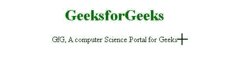

# 如何使用 CSS 在浏览器上设置光标样式？

> 原文:[https://www . geesforgeks . org/如何使用 css 在浏览器上设置光标样式/](https://www.geeksforgeeks.org/how-to-set-the-cursor-style-on-browser-using-css/)

CSS 中的[**光标**](https://www.geeksforgeeks.org/css-cursor-property/) 属性用于指定鼠标光标指向元素时要显示的类型。默认情况下，所有浏览器的光标都被设置为指针。而如果我们想定制的话，可以借助 CSS 来实现。默认情况下，光标属性的值设置为“自动”。此外，没有必要在光标属性中提及值 auto，因为默认情况下它已经设置为 auto。

**语法:**

```
cursor: value;
```

**属性值:**指定光标属性的值。请查看[这篇](https://www.geeksforgeeks.org/css-cursor-property/)文章，查看光标属性的所有值。

**示例:**在本例中，我们将光标属性值设置为十字准线，即‘光标:十字准线’，将光标显示为十字准线。

## 超文本标记语言

```
<!DOCTYPE html>
<html lang="en">

<head>
    <style>
        .cursor {
            cursor: crosshair;
        }
    </style>
</head>

<body style="text-align:center;">
    <h1 style="color:green;">
        GeeksforGeeks
    </h1>

    <p class="cursor">
        GfG, A computer Science Portal for Geeks
    </p>

</body>

</html>
```

**输出:**



光标属性示例