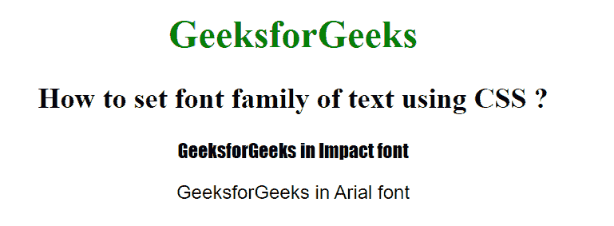

# 如何使用 CSS 设置文本的字体系列？

> 原文:[https://www . geeksforgeeks . org/如何使用 css 设置字体系列/](https://www.geeksforgeeks.org/how-to-set-the-font-family-of-text-using-css/)

CSS 字体属性用于设置 HTML 元素的字体内容。font-family 属性指定元素的字体。它可以有多种字体作为备份系统，即如果浏览器不支持一种字体，则可以使用另一种字体。

**语法:**

```css
element_selector {
   font-family: fonts-name | initial | inherit;
}
```

**属性值:**

*   **字体-名称:**用逗号分隔的引号中的字体名称。
*   **初始值:**将属性设置为默认值。
*   **inherit:** 它从父元素继承属性。

**示例:**

## 超文本标记语言

```css
<!DOCTYPE html>
<html>

<head>
    <title>
        How to set font family
        of text using CSS ?
    </title>

    <style>
        body {
            text-align: center;
        }

        h1 {
            color: green;
        }

        .para1 {
            font-family: "Impact", Times, serif;
        }

        .para2 {
            font-family: Arial, Helvetica, sans-serif;
        }
    </style>
</head>

<body>
    <h1>GeeksforGeeks</h1>

    <h2>
        How to set font family
        of text using CSS ?
    </h2>

    <p class="para1">
        GeeksforGeeks in Impact font
    </p>

    <p class="para2">
        GeeksforGeeks in Arial font
    </p>

</body>

</html>
```

**输出:**

