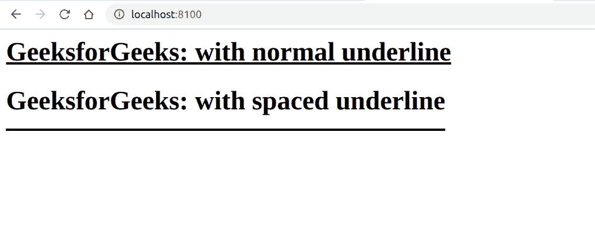

# 如何用 CSS 设置文字和下划线的间距？

> 原文:[https://www . geeksforgeeks . org/如何使用 css 设置文本和下划线之间的间距/](https://www.geeksforgeeks.org/how-to-set-the-gap-between-text-and-underlining-using-css/)

**简介:**利用 CSS 让网站在视觉上更有吸引力，可读性更强。它可以用来格式化网站上的文本，如颜色、字体大小、字体系列等。在这篇文章中，我们将看到如何在下划线文本的情况下，增加文本和下划线之间的差距。
**方法:**我们将要使用的技巧是通过使用 [**边框-底部样式的**](https://www.geeksforgeeks.org/css-border-bottom-style-property/) 和 [**填充-底部**](https://www.geeksforgeeks.org/css-padding-bottom-property/) 属性来实现这一点。而不是使用内置的 [*文字装饰*](https://www.geeksforgeeks.org/css-text-decoration-property/) *:下划线；*我们将使用[边框-底部样式的](https://www.geeksforgeeks.org/css-border-bottom-style-property/)属性创建我们自己的下划线，然后我们可以添加[填充-底部](https://www.geeksforgeeks.org/css-padding-bottom-property/)来根据我们的需要将其推开。
**语法:**

```html
.class_name {
    padding-bottom: value;
    border-bottom-style: solid;
}
```

**示例:**我们可以使用 CSS 增加文本和下划线之间的间距。

## 超文本标记语言

```html
<!DOCTYPE html>
<html>

<head>
    <title>
        How to Set the Gap Between Text
        and Underlining using CSS ?
    </title>

    <style>
        .line {

            /* Increase this as per requirement */
            padding-bottom: 15px;
            border-bottom-style: solid;
            border-bottom-width: 3.1px;
            width: fit-content;
        }

        .normal-underline {
            text-decoration: underline;
        }
    </style>
</head>

<body>
    <h1 class="normal-underline">
        GeeksforGeeks: with normal underline
    </h1>

    <h1 class="line">
        GeeksforGeeks: with spaced underline
    </h1>
</body>

</html>
```

**输出:**

