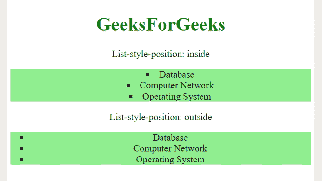

# 如何在 CSS 中设置列表项标记出现在内容流内部？

> 原文:[https://www . geesforgeks . org/如何设置列表项标记出现在 css 内容流中/](https://www.geeksforgeeks.org/how-to-set-the-list-item-marker-appear-inside-the-content-flow-in-css/)

任务是将列表项标记设置为出现在 CSS 的内容流中。要指定列表项标记的类型，可以使用列表样式类型和列表样式位置属性。内容流是一组规则，定义了哪个元素在另一个元素之前，哪个元素位于另一个元素之上，等等。

*   **列表样式类型:**用于指定列表中列表项标记的类型。
*   **列表样式位置:**用于指定列表项标记的位置。

**语法–**

```css
list-style-position: value;
```

**其中值为–**

*   内部–项目符号将位于列表项目内部。
*   外部(默认)-项目符号将在列表项目之外。
*   初始–将该属性设置为默认值。
*   inherit–从其父元素继承该属性。

**进场–**

*   用列表元素创建 HTML 文件。
*   使用列表样式位置属性将列表项标记设置为显示在内容流中。

**示例–**

## 超文本标记语言

```css
<!DOCTYPE html>
<html>

<head>
    <style type="text/css">
        body {
            font-size: 20px;
            text-align: center;
        }

        ul.x {
            list-style-position: inside;
            background-color: lightgreen;
            list-style-type: square;
        }

        ul.y {
            list-style-position: outside;
            list-style-type: square;
            background-color: lightgreen;
        }
    </style>
</head>

<body>
    <h1 style="color:green">GeeksForGeeks</h1>

    <p>List-style-position: inside</p>

    <ul class="x">
        <li>Database</li>
        <li>Computer Network</li>
        <li>Operating System</li>
    </ul>

    <p>List-style-position: outside</p>

    <ul class="y">
        <li>Database</li>
        <li>Computer Network</li>
        <li>Operating System</li>
    </ul>
</body>

</html>
```

**输出–**

