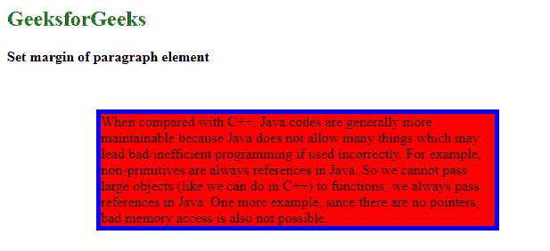
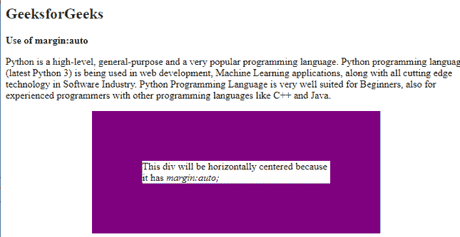

# 如何用 CSS 设置段落元素的边距？

> 原文:[https://www . geeksforgeeks . org/如何使用 css 设置段落元素的边距/](https://www.geeksforgeeks.org/how-to-set-the-margins-of-a-paragraph-element-using-css/)

[CSS 边距](https://www.geeksforgeeks.org/css-margins-padding/)属性用于在任何特征边界之外的组件周围留出空间。有了 CSS，你就有了超越边界的全部力量。组件的每一侧(顶部、右侧、底部和左侧)都有设置边缘的属性。

CSS 具有指示组件每一侧边缘的属性。

*   [页边距-顶部](https://www.geeksforgeeks.org/css-margin-top-property/)
*   [右边距](https://www.geeksforgeeks.org/css-margin-right-property/)
*   [边距-底部](https://www.geeksforgeeks.org/css-margin-bottom-property/)
*   [左边距](https://www.geeksforgeeks.org/css-margin-left-property/)

所有边距属性都可以有以下值。

*   **自动:**浏览器计算边距
*   **长度:**以 px、pt、cm 等为单位指定边距。
*   **%:** 它指定包含元素宽度的百分比边距。
*   **inherit:** 它指定边距应该从父元素继承。

**示例 1:** 在以下示例中，HTML [*div*](https://www.geeksforgeeks.org/div-tag-html/) 用于段落的样式。边框宽度为 5px，纯蓝颜色。段落的边距是按照上边距 50px，右边距 50px，下边距 100px，左边距 100px，底色为红色。

## 超文本标记语言

```
<!DOCTYPE html>
<html>
  <head>
    <style>
      div {
        border: 5px solid blue;
        margin: 50px 50px 100px 100px;
        background-color: red;
      }
    </style>
  </head>
  <body>
    <h2 style="color: green">GeeksforGeeks</h2>
    <b>Set margin of paragraph element</b>

    <div>
      When compared with C++, Java codes are generally 
      more maintainable because Java does not allow many
      things which may lead bad/inefficient programming
      if used incorrectly. For example, non-primitives 
      are always references in Java. So we cannot pass 
      large objects (like we can do in C++) to functions, 
      we always pass references in Java. One more example, since
      there are no pointers, bad memory access is also not possible.
    </div>
  </body>
</html>
```

**输出:**



**示例 2:** 在下面的示例中，宽度为 300px，段落的边距将相同，并且将位于中心，因为它具有*边距:auto。*边框宽度为 80px，颜色为紫色。

## 超文本标记语言

```
<!DOCTYPE html>
<html>
  <head>
    <style>
      div {
        width: 300px;
        margin: auto;
        border: 80px solid purple;
      }
    </style>
  </head>
  <body>
    <h2 style="color: green">GeeksforGeeks</h2>
    <b>Use of margin:auto</b>
    <p>
      Python is a high-level, general-purpose and a
      very popular programming language. Python programming
      language (latest Python 3) is being used in web development,
      Machine Learning applications, along with all cutting
      edge technology in Software Industry. Python Programming
      Language is very well suited for Beginners, also for 
      experienced programmers with other
      programming languages like C++ and Java.
    </p>

    <div>
      This div will be horizontally centered
      because it has <i>margin:auto;</i>
    </div>
  </body>
</html>
```

**输出:**



自动边距