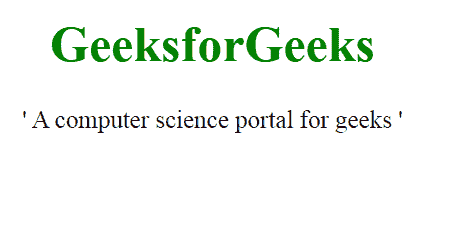

# 如何设置 CSS 中引用的标记？

> 原文:[https://www . geeksforgeeks . org/如何设置 css 报价标记/](https://www.geeksforgeeks.org/how-to-set-the-marks-for-quotations-in-css/)

任务是为 CSS 中的引用设置引号。引号 **[" "]** 用于衬托代表引用或口语的材料，引号是 [CSS 引号属性](https://www.geeksforgeeks.org/css-quotes-property/)用于设置引号的类型。

**方法:**首先创建带有段落元素的 HTML 页面，然后在< q >元素的帮助下，在适当的地方提供一个引号。

**语法:**

```
quotes:values;
```

**引号:**

<figure class="table">

| Entity number | name | output |
| --- | --- | --- |
| \ 0022 | double quotation mark |  |
| \ 0027 | single quotation mark | ' |
| Zuojiao daily | << |
| \ 00BB | Double and right corner newspaper | >> |
| \ 2018 | Left corner newspaper (single height -6) | ' |
| \ n |

</figure>

**示例:**

## 超文本标记语言

```
<!DOCTYPE html>
<html>
  <head>
    <style>
      body {
        text-align: center;
        font-size: 25px;
      }

      #a {
        quotes: "'" "'";
      }
    </style>
  </head>
  <body>
    <h1 style="color: green">
      GeeksforGeeks
    </h1>

    <p><q id="a"> 
        A computer science portal for geeks 
       </q>
    </p>
  </body>
</html>
```

**输出:**

