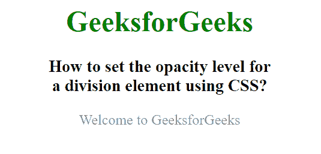
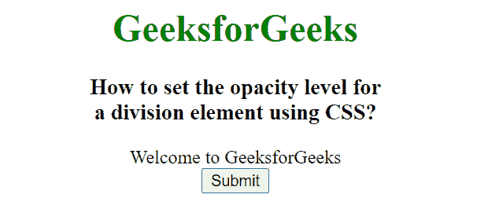
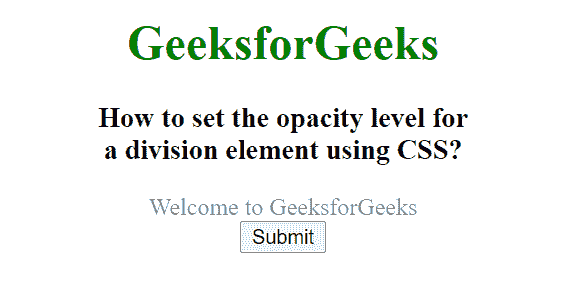

# 如何用 CSS 设置一个分割元素的不透明度？

> 原文:[https://www . geeksforgeeks . org/如何使用 css 设置分割元素的不透明度级别/](https://www.geeksforgeeks.org/how-to-set-the-opacity-level-for-a-division-element-using-css/)

在本文中，我们将使用 CSS 设置元素的不透明度。不透明度是描述元素透明度的元素属性。

不透明度属性用于描述元素的透明度。不透明度的值介于 0.0 到 1.0 之间，其中低值表示高透明度，高值表示低透明度。不透明度百分比计算为不透明度% =不透明度* 100。

**例 1:**

## 超文本标记语言

```html
<!DOCTYPE html>
<html lang="en">

<head>
    <title>
        How to set the opacity level for
        a division element using CSS?
    </title>
    <style>
        body {
            text-align: center;
        }

        h1 {
            color: green;
        }

        .GFG {
            opacity: 0.5;
        }
    </style>
</head>

<body>
    <h1>GeeksforGeeks</h1>

    <h3>
        How to set the opacity level for
        <br>a division element using CSS?
    </h3>

    <div class="GFG">
        Welcome to GeeksforGeeks
    </div>
</body>

</html>
```

**输出:**



**例 2:**

## 超文本标记语言

```html
<!DOCTYPE html>
<html lang="en">

<head>
    <title>
        How to set the opacity level for
        a division element using CSS?
    </title>
    <style>
        body {
            text-align: center;
        }

        h1 {
            color: green;
        }
    </style>

    <script>
        function fun() {
            document.getElementById("GFG")
                .style.opacity = "0.5";
        } 
    </script>
</head>

<body>
    <h1>GeeksforGeeks</h1>

    <h3>
        How to set the opacity level for
        <br>a division element using CSS?
    </h3>

    <div id="GFG">
        Welcome to GeeksforGeeks
    </div>

    <button type="button" onclick="fun()">
        Submit
    </button>
</body>

</html>
```

**输出:**

**按钮点击前:**



**按钮点击后:**

