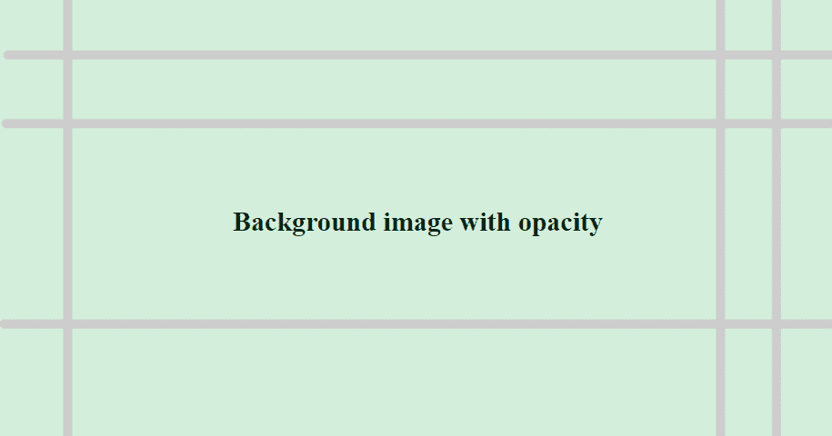

# 如何在 CSS 中设置背景图像的不透明度？

> 原文:[https://www . geeksforgeeks . org/如何设置 css 中背景图像的不透明度/](https://www.geeksforgeeks.org/how-to-set-the-opacity-of-background-image-in-css/)

在本文中，我们将看到如何在 CSS 中设置背景图像的不透明度。不透明度可以定义为缺乏透明度的质量。它可以用来定义可见内容的数量。

**方法:**我们可以在 CSS 中使用 **[不透明度属性](https://www.geeksforgeeks.org/css-opacity-transparency/)** ，用来改变元素的不透明度。属性的值可以设置在 0 到 1 的范围内，其中“0”是完全透明的，“1”是不透明的。在这两者之间可以使用任何小数值来相应地设置不透明度。

**语法:**

```html
opacity: value;
```

**示例:**在本例中，我们将背景图像设置为< div >，并使用不透明度属性设置该图像的不透明度。不透明度设置为 0.2，使背景变得透明，图像顶部的文本清晰可见。

## 超文本标记语言

```html
<!DOCTYPE html>
<html>

<head>
    <title>
        How to change opacity of
        background image in CSS ?
    </title>

    <style>
        #GFG {
            height: 100vh;
            display: flex;
            align-items: center;
            justify-content: center;
        }

        #GFG::before {
            content: "";
            position: absolute;
            top: 0px;
            right: 0px;
            bottom: 0px;
            left: 0px;

            /* Specify the background image to be used */
            background-image: url(
'https://media.geeksforgeeks.org/wp-content/uploads/20210313130410/exbg.png');
            background-size: cover;

            /* Specify the background image */
            opacity: 0.2;
        }
    </style>
</head>

<body>
    <div id="GFG">
        <h2>Background image with opacity</h2>
    </div>
</body>

</html>
```

**输出:**

