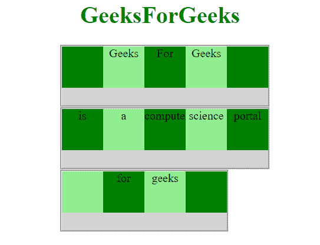

# 如何使用 CSS 设置灵活项的顺序？

> 原文:[https://www . geeksforgeeks . org/如何使用 css 设置灵活项目的顺序/](https://www.geeksforgeeks.org/how-to-set-the-order-of-the-flexible-items-using-css/)

本文的目的是使用 CSS 设置灵活项目的顺序。您可以通过使用 CSS order 属性来完成此任务。

[**CSS 顺序属性**](https://www.geeksforgeeks.org/css-order-property/) **:** 该属性用于指定一个柔性项相对于同一容器内其余柔性项的顺序，切记将元素设置为柔性。

**语法:**

```
order: value;
```

**进场:**

用不同的 div 元素创建 Html 页面，并用不同的 id 号分配所有的 div 元素。使用 order 属性，您可以随时以正确的顺序重新排列这些框。

**示例:**

## 超文本标记语言

```
<!DOCTYPE html>
<html>

<head>
    <style>
        #gfg1 {
            margin-left: 145px;
            width: 350px;
            height: 100px;
            border-style: groove;
            display: flex;
            background-color: lightgrey;
        }

        #gfg1 div {
            width: 70px;
            height: 70px;
        }

        #gfg2 {
            margin-left: 145px;
            width: 350px;
            height: 100px;
            border-style: groove;
            display: flex;
            background-color: lightgrey;
        }

        #gfg2 div {
            width: 70px;
            height: 70px;
        }

        #gfg3 {
            margin-left: 145px;
            width: 280px;
            height: 100px;
            border-style: groove;
            display: flex;
            background-color: lightgrey;
        }

        #gfg3 div {
            width: 70px;
            height: 70px;
        }

        body {
            text-align: center;
            font-size: 20px;
        }

        div#div1 {
            order: 2;
        }

        div#div2 {
            order: 3;
        }

        div#div3 {
            order: 4;
        }

        div#div4 {
            order: 1;
        }

        div#div0 {
            order: 5
        }
    </style>
</head>

<body>

    <h1 style="color:green">GeeksForGeeks</h1>

    <div id=g fg1>
        <div style="background-color:green;"
             id="div0"></div>
        <div style="background-color:lightgreen;"
             id="div1">Geeks</div>
        <div style="background-color:green;"
             id="div2">For</div>
        <div style="background-color:lightgreen;"
             id="div3">Geeks</div>
        <div style="background-color:green;"
             id="div4"></div>
    </div>
    <div id=g fg2>
        <div style="background-color:green;"
             id="div0">portal</div>
        <div style="background-color:lightgreen;"
             id="div1">a</div>
        <div style="background-color:green;"
             id="div2">computer</div>
        <div style="background-color:lightgreen;"
             id="div3">science</div>
        <div style="background-color:green;"
             id="div4">is</div>
    </div>
    <div id=g fg3>
        <div style="background-color:green;"
             id="div0"></div>
        <div style="background-color:lightgreen;"
             id="div1"></div>
        <div style="background-color:green;"
             id="div2">for</div>
        <div style="background-color:lightgreen;"
             id="div3">geeks</div>

    </div>

</body>

</html>
```

**输出:**



**支持的浏览器:**

*   谷歌 Chrome
*   微软公司出品的 web 浏览器
*   火狐浏览器
*   歌剧
*   旅行队