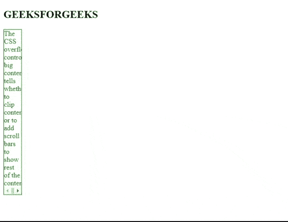

# 如何在 CSS 中设置溢出属性滚动？

> 原文:[https://www . geeksforgeeks . org/如何设置溢出属性以在 css 中滚动/](https://www.geeksforgeeks.org/how-to-set-the-overflow-property-to-scroll-in-css/)

在本文中，我们将看到如何设置[溢出属性](https://www.geeksforgeeks.org/css-overflow/)在 CSS 中滚动。溢出属性用于控制大内容。它告诉我们当一个元素的内容太大而无法放入指定的区域时该怎么做。当 overflow 属性设置为 scroll 时，溢出将被剪切，但会添加一个滚动条来查看其余部分。

**例 1:**

## 超文本标记语言

```html
<!DOCTYPE html>
<html>

<head>
    <style>
        p {
            width: 120px;
            height: 100px;
            border: 1px solid;
            overflow: scroll;
            color: green;
        }
    </style>
</head>

<body>
    <h2>GEEKSFORGEEKS</h2>

    <p>
        The CSS overflow controls big content.
        It tells whether to clip content or to
        add scroll bars.
    </p>
</body>

</html>
```

**输出:**


**例 2:** 在本例中，我们必须使用 [overflow-x 属性](https://www.geeksforgeeks.org/css-overflow-x-property/)进行滚动。当内容在左右边缘溢出时，使用 overflow-x 属性。

## 超文本标记语言

```html
<!DOCTYPE html>
<html>

<head>
    <style>
        p {
            color: green;
            width: 40px;
            border: 1px solid;
            overflow-x: scroll;
        }
    </style>
</head>

<body>
    <h2>GEEKSFORGEEKS</h2>

    <p>
        The CSS overflow controls big 
        content. It tells whether to 
        clip content or to add scroll 
        bars to show rest of the content.
    </p>
</body>

</html>
```

**输出:**



**示例 3:** 在本例中，我们使用了 overflow-y 属性进行滚动。当内容在上下边缘溢出时，使用[溢出属性](https://www.geeksforgeeks.org/css-overflow-y-property/)

## 超文本标记语言

```html
<!DOCTYPE html>
<html>

<head>
    <style>
        p {
            color: green;
            height: 50px;
            width: 200px;
            border: 1px solid;
            overflow-y: scroll;
        }
    </style>
</head>

<body>
    <h2>GEEKSFORGEEKS</h2>

    <p>
        The CSS overflow controls big 
        content. It tells whether to 
        clip content or to add scroll 
        bars to show rest of the content.
    </p>
</body>

</html>
```

**输出:**

