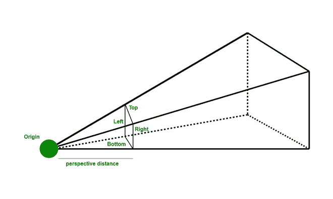
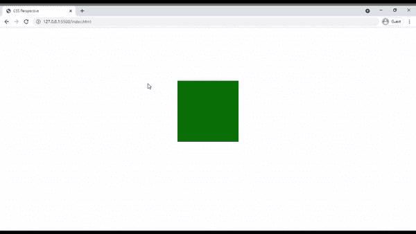

# 如何设置在 CSS 中从哪个位置查看元素的视角？

> 原文:[https://www . geeksforgeeks . org/如何设置在 css 中查看元素的视角/](https://www.geeksforgeeks.org/how-to-set-the-perspective-from-where-an-element-is-viewed-in-css/)

在本文中，我们将看到 CSS 视角是如何工作的。 [CSS 透视图](https://www.geeksforgeeks.org/css-perspective-property/)是一个新的 CSS 属性，必须提供它来管理 z 轴之间的距离。我们都知道我们使用的是 2D 曲面。所以如果我们旋转我们的对象，那么这种完整性就不会显示出来。这个问题的解决方案是 CSS 透视图，我们甚至可以看到 z 轴。



如果光源离物体很远，它们就像投影仪一样工作，所以在墙上形成一个大图像。通过将透视属性应用于父元素并对子元素进行任何看起来像 3D 元素的转换，可以非常简单地使用它们。

**语法:**

```html
/* parent div */
perspective: perspective_distance;

/* child div */
transform: value;
```

如果父 div 应用了透视，那么子 div 中的任何变换属性都将应用，因此它们表现为一个三维对象

**示例 1:** 下面的示例是在不使用透视的情况下说明的。

## 超文本标记语言

```html
<!DOCTYPE html>
<html lang="en">
<head>
  <style>
    body {
        display: flex;
        justify-content: center;
        align-items: center;
        height: 80vh;
     }

    /* parent div */
    .main{
        width: 200px;
        height: 200px;
        background-color: gray;
     }

    /* child div */
    .box {
        width: 200px;
        height: 200px;
        background-color: #0B7008;
        /* transform the child object. */
        transform: rotateX(60deg);
     }
  </style>
</head>

<body>
<!-- parent div -->
    <div class="main">
<!-- child div -->
        <div class="box"></div>
    </div>
</body>

</html>
```

**输出:**


**示例 2:** 下面是说明透视的使用的示例。

## 超文本标记语言

```html
<!DOCTYPE html>
<html lang="en">

<head>
  <style>
      body {
          display: flex;
          justify-content: center;
          align-items: center;
          height: 80vh;
      }

      /* parent div */
      .main{
          width: 200px;
          height: 200px;
          background-color: gray;
          /* Create perspective */
          perspective: 800px;
      }

      /* child div */
      .box {
          width: 200px;
          height: 200px;
          background-color: #0B7008;
          /* transform the child object. */
          transform: rotateX(60deg);
      }
  </style>
</head>

<body>
<!-- parent div -->
    <div class="main">
<!-- child div -->
      <div class="box"></div>
    </div>
</body>

</html>
```

**输出:**



**支持的浏览器:**

*   谷歌 Chrome 36.0
*   Internet Explorer 10.0
*   Firefox 16.0
*   Opera 23.0
*   Safari 9.0