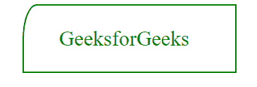

# 如何用 CSS 设置 div 左上角的形状？

> 原文:[https://www . geesforgeks . org/如何使用-css/](https://www.geeksforgeeks.org/how-to-set-the-shape-of-top-left-corner-of-div-using-css/) 设置 div 左上角的形状

在本文中，我们将学习如何使用 CSS 设置 div 左上角的形状。“左上角边框半径”属性用于形成左上角的形状。我们可以用百分比来塑造左上角的形状，为此你可以查看这篇文章 *[如何用百分比来设定左上角的形状？](https://www.geeksforgeeks.org/how-to-set-the-shape-of-the-top-left-corner-in-percentage/)T3】*

**方法:**[**边界-左上角-半径**](https://www.geeksforgeeks.org/css-border-top-left-radius-property/) 属性用于形成左上角的形状。所以我们将使用这个属性来设置左上角的形状。它取两个值第一个是 top_border，第二个是 left_border，但是我们可以省略第二个，那么第一个值就是 top_border 和 left_border 的值。

**语法:**

```css
border-top-left-radius: top_border left_border;
```

**例 1:**

## 超文本标记语言

```css
<!DOCTYPE html>
<html>
<head>
    <style>
        .gfg1{
            padding-left: 50px ;
            font-size: 30px;
            color: green;
        }
        div{
            width: 300px;
            border: solid 2px green;
            margin-left: 30%;
            border-top-left-radius: 20px 50px;
        }
    </style>
</head>
<body>
    <div class="parent">
        <p class="gfg1">GeeksforGeeks</p>

    </div>
</body>
</html>
```

**输出:**

