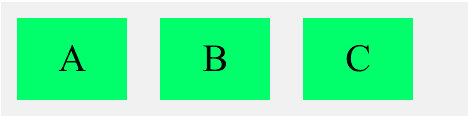
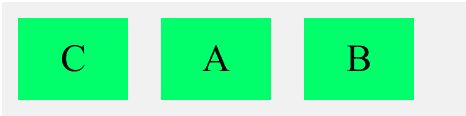
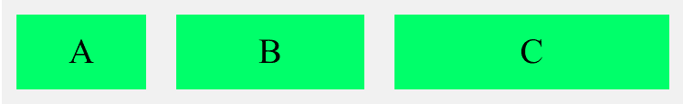
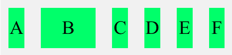
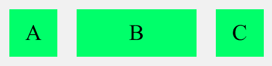
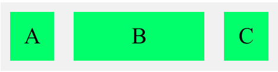
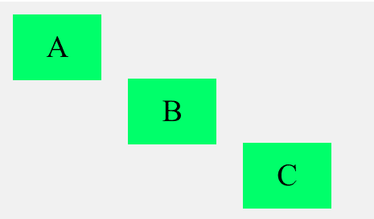

# 如何使用 CSS 设置特定伸缩项的大小？

> 原文:[https://www . geeksforgeeks . org/如何使用 css 设置特定尺寸的 flex 项目/](https://www.geeksforgeeks.org/how-to-set-the-size-of-specific-flex-item-using-css/)

CSS 提供灵活的盒子布局模块，也称*灵活盒子*，更容易设计出灵活响应的布局。要开始使用 *flexbox* 模型，我们需要首先定义一个 flex 容器，该容器的直接子元素称为 flex 项目。

Flex 具有以下预定义属性，以便更改 flex 项目的大小。

*   命令
*   伸缩生长
*   伸缩收缩
*   弹性基础
*   弯曲
*   自动校准

**语法:**

```
flex-item: order | flex-grow | flex-shrink | 
           flex-basis | auto | align-self | 
           flex | initial | inherit;
```

**样本代码:**

## 超文本标记语言

```
<!DOCTYPE html>
<html>

<head>
  <style>
    .flex-container {
        display: flex;
        background-color: #f1f1f1;
        width: 50%;
    }
    .flex-container > div {
        background-color: rgb(33, 246, 107);
        color: "#000000";
        width: 100px;
        margin: 15px;
        text-align: center;
        line-height: 75px;
        font-size: 35px;
    }
  </style>
</head>

<body>
  <div class="flex-container">
    <div>A</div>
    <div>B</div>
    <div>C</div>
  </div>
</body>

</html>
```

**输出:**



**1。顺序:**此属性可用于指定弹性项的顺序。

**示例:**下面的代码说明了弹性订单的使用。

## 超文本标记语言

```
<!DOCTYPE html>
<html>

<head>
  <style>
    .flex-container {
        display: flex;
        background-color: #f1f1f1;
        width: 50%;
    }
    .flex-container > div {
        background-color: rgb(33, 246, 107);
        color: "#000000";
        width: 100px;
        margin: 15px;
        text-align: center;
        line-height: 75px;
        font-size: 35px;
    }
  </style>
</head>

<body>
  <div class="flex-container">
    <div style="order: 2">A</div>
    <div style="order: 3">B</div>
    <div style="order: 1">C</div>
  </div>
</body>

</html>
```

**输出:**



**2。flex-grow:** 此属性可用于指定一个项目相对于容器中的其他项目可以增长多少。

**示例:**下面的代码说明了 flex-grow 属性值的使用。

## 超文本标记语言

```
<!DOCTYPE html>
<html>

<head>
  <style>
    .flex-container {
        display: flex;
        background-color: #f1f1f1;
        width: 80%;
    }
    .flex-container > div {
        background-color: rgb(33, 246, 107);
        color: "#000000";
        width: 100px;
        margin: 15px;
        text-align: center;
        line-height: 75px;
        font-size: 35px;
    }
  </style>
</head>

<body>
  <div class="flex-container">
    <div style="flex-grow: 1">A</div>
    <div style="flex-grow: 3">B</div>
    <div style="flex-grow: 6">C</div>
  </div>
</body>

</html>
```

**输出:**



**3。flex-shrink:** 这个属性可以用来指定一个项目相对于容器中其他项目可以收缩多少。它的默认值是 1。

**示例:**下面的代码说明了 flex-shrink 属性值的使用。

## 超文本标记语言

```
<!DOCTYPE html>
<html>

<head>
  <style>
    .flex-container {
        display: flex;
        background-color: #f1f1f1;
        width: 50%;
    }

    .flex-container > div {
        background-color: rgb(33, 246, 107);
        color: "#000000";
        width: 100px;
        margin: 15px;
        text-align: center;
        line-height: 75px;
        font-size: 35px;
    }
  </style>
</head>

<body>
  <div class="flex-container">
    <div>A</div>
    <div style="flex-shrink: 0">B</div>
    <div>C</div>
    <div>D</div>
    <div>E</div>
    <div>F</div>
  </div>
</body>

</html>
```

**输出**:



**4。flex-basis:** 此属性可用于指定 flex 容器中项目的初始长度。

**示例:**下面的代码说明了弹性基的使用。

## 超文本标记语言

```
<!DOCTYPE html>
<html>

<head>
  <style>
    .flex-container {
        display: flex;
        background-color: #f1f1f1;
        width: 50%;
    }
    .flex-container > div {
        background-color: rgb(33, 246, 107);
        color: "#000000";
        width: 100px;
        margin: 15px;
        text-align: center;
        line-height: 75px;
        font-size: 35px;
    }
  </style>
</head>

<body>
  <div class="flex-container">
    <div>A</div>
    <div style="flex-basis: 250px">B</div>
    <div>C</div>
  </div>
</body>

</html>
```

**输出**:



**5。flex:** 该属性是 flex-grow、flex-short 和 flex-based 的集合。您可以在 flex 中指定所有三个属性。

**示例:**下面的代码说明了 flex 的使用。

## 超文本标记语言

```
<!DOCTYPE html>
<html>

<head>
  <style>
    .flex-container {
      display: flex;
      background-color: #f1f1f1;
      width: 50%;
    }
    .flex-container > div {
      background-color: rgb(33, 246, 107);
      color: "#000000";
      width: 100px;
      margin: 15px;
      text-align: center;
      line-height: 75px;
      font-size: 35px;
    }
  </style>
</head>

<body>
  <div class="flex-container">
    <div>A</div>
    <div style="flex: 2 0 200px">B</div>
    <div>C</div>
  </div>
</body>

</html>
```

**输出**:



**6。align-self:** 此属性可用于指定选定元素的对齐方式。定义后，它将覆盖容器定义的对齐方式。它需要取值:中心、弹性起点或弹性终点。

**示例:**下面的代码说明了 flex align-self 属性值的使用。

## 超文本标记语言

```
<!DOCTYPE html>
<html>

<head>
  <style>
    .flex-container {
        display: flex;
        background-color: #f1f1f1;
        width: 50%;
        height: 250px;
    }
    .flex-container > div {
        background-color: rgb(33, 246, 107);
        color: "#000000";
        width: 100px;
        margin: 15px;
        text-align: center;
        line-height: 75px;
        font-size: 35px;
    }
  </style>
</head>

<body>
  <div class="flex-container">
    <div style="align-self: flex-start">A</div>
    <div style="align-self: center">B</div>
    <div style="align-self: flex-end">C</div>
  </div>
</body>

</html>
```

**输出**:

