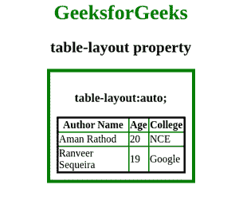
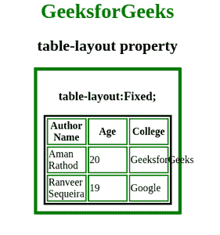

# 如何使用 CSS 设置表格布局算法？

> 原文:[https://www . geeksforgeeks . org/如何使用 css 设置表格布局算法/](https://www.geeksforgeeks.org/how-to-set-the-table-layout-algorithm-using-css/)

您可以使用[**表格布局属性**](https://www.geeksforgeeks.org/css-table-layout-property/) 设置表格布局算法，该属性用于显示表格的布局。在本文中，您将学习**自动**和**固定**布局算法来形成表格。

**语法:**

```
table-layout: auto|fixed;
```

**示例 1:** 使用自动布局算法。

**注意:**在自动布局算法中，浏览器会扩展行或列以容纳更大的内容位，这样内容就不会溢出。这里浏览器需要分析整个表格的内容。这可能是一个有点慢的处理布局。

## 超文本标记语言

```
<!DOCTYPE html>
<html>
    <head>
        <style>
            table {
            border-collapse: collapse;
            border: 3px solid black;
            }

            th, td {
            border: 2px solid green;
            }

            table#gfg {
            table-layout: auto;
            width: 200px;
            }

            div {
                max-width:200px;
                padding:10px;
                border:5px solid green;
            }

            h1 {
                color:green;
            }
        </style>
    </head>
    <body>
        <center>
        <h1>GeeksforGeeks</h1>
        <h2>table-layout property</h2>
        <div>
        <h3>table-layout:auto;</h3>
        <table id = "gfg">
            <tr>
                <th>Author Name</th>
                <th>Age</th>
                <th>College</th>
            </tr>
            <tr>
                <td>Aman Rathod</td>
                <td>20</td>
                <td>NCE</td>
            </tr>
            <tr>
                <td>Ranveer Sequeira</td>
                <td>19</td>
                <td>Google</td>
            </tr>
        </table>
        </div>

    </center>
    </body>
</html>
```

**输出:**



**例 2:** 采用固定布局算法。

**注意:**在固定布局算法中，Browser 使用第一行来确定列宽，不需要分析整个表格的内容。所以它是一个更快的处理布局。

## 超文本标记语言

```
<!DOCTYPE html>
<html>
    <head>
        <style>

            table {
            border-collapse: separate;
            border: 3px solid black;
            }

            th, td {
            border: 2px solid green;
            }

            table#table1 {
            table-layout: fixed;
            width: 200px;
            }

            div {
                max-width:200px;
                padding:10px;
                border:5px solid green;
            }

            h1 {
                color:green;
            }
        </style>
    </head>
    <body>
        <center>
        <h1>GeeksforGeeks</h1>
        <h2>table-layout property</h2>
        <div>
        <h3>table-layout:Fixed;</h3>
        <table id = "table1">
            <tr>
                <th>Author Name</th>
                <th>Age</th>
                <th>College</th>
            </tr>
            <tr>
                <td>Aman Rathod</td>
                <td>20</td>
                <td>GeeksforGeeks</td>
            </tr>
            <tr>
                <td>Ranveer Sequeira</td>
                <td>19</td>
                <td>Google</td>
            </tr>
        </table>
        </div>

    </center>
    </body>
</html>
```

**输出:**

