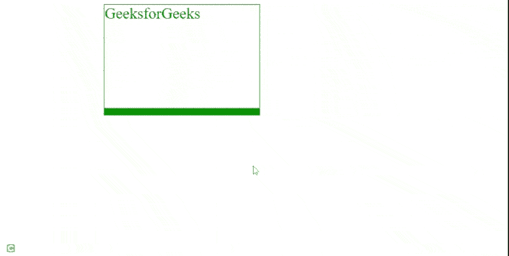

# 如何设置可使用 CSS 动画化的下边框宽度？

> 原文:[https://www . geeksforgeeks . org/如何使用 css 设置底部边框宽度-可动画化/](https://www.geeksforgeeks.org/how-to-set-the-width-of-the-bottom-border-animatable-using-css/)

在本文中，我们将学习使用 CSS 设置边框底部动画的宽度。

**逼近:**[边框-底部-宽度](https://www.geeksforgeeks.org/css-border-bottom-width-property/)是底部边框的宽度，我们想要动画显示它的宽度。我们将使用 CSS 的[动画](https://www.geeksforgeeks.org/css-animations/)属性。它需要三个值

*   The first is the name of the animation which is a [*keyframe*](https://www.geeksforgeeks.org/css-animation-and-keyframes-property/) name that we want to bind with.

    **语法:**

    ```html
    @keyframe myFun
    {
    100%{
         border-bottom-color: red;
      }
    }
    ```

*   第二是它活跃的时间。
*   And the last one is the number of times we want to animate.

    **语法:**

    ```html
    animation: animation_name animation_duration animation_count
    ```

**示例:**

## 超文本标记语言

```html
<!DOCTYPE html>
<html>
  <head>
    <style>
      .gfg {
        width: 300px;
        height: 200px;
        border: solid 1px green;
        color: green;
        font-size: 30px;
        margin-left: 20%;
        animation: myFun 5s infinite;
      }
      @keyframes myFun {
        100% {
          border-bottom-width: 25px;
        }
      }
    </style>
  </head>
  <body>
    <div class="gfg">GeeksforGeeks</div>
  </body>
</html>
```

**输出:**



动画