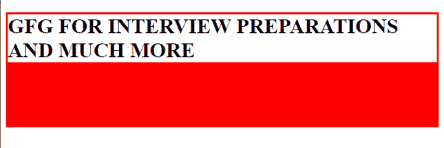
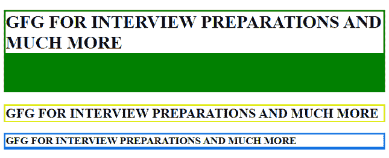

# 如何在 CSS 中设置下边框的宽度？

> 原文:[https://www . geeksforgeeks . org/如何设置 css 中的下边框宽度/](https://www.geeksforgeeks.org/how-to-set-the-width-of-the-bottom-border-in-css/)

我们可以使用 [**边框-底部-宽度**](https://www.geeksforgeeks.org/css-border-bottom-width-property/) CSS 属性设置底部边框的宽度。我们可以给出像素大小，也可以给出预定义的值，如*厚，薄*等。

**方法 1:**

*   我们将在标签中使用内嵌 CSS。
*   我们将使用 [*边框颜色*](https://www.geeksforgeeks.org/css-border-color-property/)*[*边框样式*](https://www.geeksforgeeks.org/css-border-style-property/) 属性来明确定义边框。*
*   *我们可以使用 [***边框-底部-宽度***](https://www.geeksforgeeks.org/css-border-bottom-width-property/) 属性给出底部边框的宽度。*

***示例:***

## *超文本标记语言*

```css
*<!DOCTYPE html>
<html>
<head>
    <title>Width Bottom Border CSS</title>
</head>
<body>
  <h1 style="border-color : red ;
             border-style : solid ;
             border-bottom-width : 100px ;">
    GFG FOR INTERVIEW PREPARATIONS AND MUCH MORE</h1>
</body>
</html>*
```

***输出:***

*

边框底部宽度* 

***方法 2:***

*   *我们在样式标签中使用了 CSS，也称为 [**【内部 CSS】**](https://www.geeksforgeeks.org/types-of-css-cascading-style-sheet/)。*
*   *我们可以使用 [*边框-底部-宽度*](https://www.geeksforgeeks.org/css-border-bottom-width-property/) 以像素为单位给出底部边框的宽度，以及预定义的值，如*细、粗*等。*

***示例:***

## *超文本标记语言*

```css
*<!DOCTYPE html>
<html>
<head>
<title>Width Bottom Border CSS</title>
    <style>
        h1{
            border-color:green;
            border-style:solid;
            border-bottom-width:70px ;
        }
        h2{
            border-color:rgb(224, 238, 23);
            border-style:solid;
            border-bottom-width:thin  ;
        }
        h3{
            border-color:rgb(23, 123, 238);
            border-style:solid;
            border-bottom-width:thick  ;
        }
    </style>
</head>
<body>
  <h1>GFG FOR INTERVIEW PREPARATIONS AND MUCH MORE</h1>
  <h2>GFG FOR INTERVIEW PREPARATIONS AND MUCH MORE</h2>
  <h3>GFG FOR INTERVIEW PREPARATIONS AND MUCH MORE</h3>
</body>
</html>*
```

***输出:***

*

边框底宽厚*