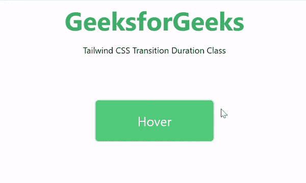

# 如何在顺风 CSS 中设置转场时长？

> 原文:[https://www . geesforgeks . org/如何设置过渡-顺风持续时间-css/](https://www.geeksforgeeks.org/how-to-set-transition-duration-in-tailwind-css/)

在本文中，我们将看到如何在[顺风 CSS](https://www.geeksforgeeks.org/css-tailwind-introduction/) 中设置过渡持续时间。Tailwind CSS 是一个高度可定制的、实用程序优先的 CSS 框架，我们可以使用实用程序类来构建任何设计。

过渡持续时间类在顺风 CSS 中接受很多值，其中所有属性都以类的形式被覆盖。*过渡-持续时间*类用于指定完成过渡效果的时间长度(以秒或毫秒为单位)。它是 [CSS 过渡持续时间](https://www.geeksforgeeks.org/css-transition-duration-property/)属性的替代。

为了使用顺风 CSS，我们必须将顺风 CSS 添加到我们的项目文件夹中。

**安装:**

**方法 1:** 通过 npm 安装顺风

**第一步:**

```html
npm init -y
```

**第二步:**

```html
npm install tailwindcss
```

**第三步:**现在我们必须使用 *@tailwind* 指令将 Tailwind 的基础、组件和实用程序样式注入到我们的 CSS 文件中，从而将 tailwind 添加到我们的 CSS 中。

```html
@tailwind base;  
@tailwind components;  
@tailwind utilities;
```

**第四步:**

```html
npx tailwindcss init
```

**注意:**这是一个可选步骤，用于创建顺风配置文件。

**第五步:**

```html
npx tailwindcss build styles.css -o output.css  
```

**方法 2:** 通过 CDN 链路利用顺风

> <link href="”https://unpkg.com/tailwindcss@^2/dist/tailwind.min.css”" rel="”stylesheet”">

**示例:**在本例中，我们使用了过渡持续时间类将过渡持续时间设置为 500ms。

## 超文本标记语言

```html
<!DOCTYPE html>
<html>

<head>
    <link href=
"https://unpkg.com/tailwindcss@^1.0/dist/tailwind.min.css"
        rel="stylesheet">
</head>

<body class="text-center mx-4 space-y-2">
    <h1 class="text-green-600 text-5xl font-bold">
        GeeksforGeeks
    </h1>

    <p>Tailwind CSS Transition Duration Class</p>

    <br><br><br>
    <button class="text-white bg-green-500 
            md:border-2 rounded-lg p-5 
            hover:shadow-inner w-56 text-2xl 
            transform hover:scale-125 
            hover:bg-green-700 transition 
            ease-out duration-500">
        Hover
    </button>
</body>

</html>
```

**输出:**

