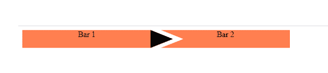
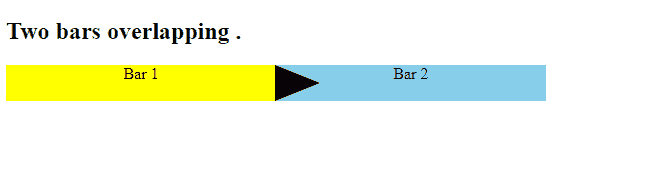

# 如何在 CSS 中设置两个圆角箭头相互重叠的条？

> 原文:[https://www . geeksforgeeks . org/如何在 css 中设置两个带圆形箭头的条形-相互重叠/](https://www.geeksforgeeks.org/how-to-set-two-bars-with-rounded-arrows-overlapping-each-other-in-css/)

在本文中，我们将讨论如何使用 HTML 和 CSS 设置两个带圆角箭头的条。

**示例 1:** 在下面的 HTML 代码中，我们使用带有属性类的元素< div >。使用*类*属性对页面的其他元素进行分组。CSS 代码位于 HTML 代码的<样式>部分，在这里我们为< div class="container" >使用了许多不同的属性，例如 *flex、display、align-items、align-content、边距-right、position、background、*等，用于类“bar1”和“bar 2”。

## 超文本标记语言

```
<!DOCTYPE html>
<html>
<head>
<style>
.container {
  width: 40%;
  height: 36px;
  display: flex;
  color: black;
}
.container .bar1 {
  flex: 1;
  display: flex;
  justify-content: center;
  margin-right: 20px;
  position: relative;
  background: coral;
}

.container .bar1:after {
  content: "";
  position: absolute;
  right: -44px;
  height: 0;
  border-left: 45px solid black;
  border-top: 18px solid transparent;
  border-bottom: 18px solid transparent;
}
.container .bar2 {
  flex: 1;
  display: flex;
  background: coral;
  position: relative;
  z-index: -1;
  justify-content: center;
  color: black;
}
.container .bar2:after {
  content: "";
  position: absolute;
  left: 0;
  bottom: 0;
  width: 0;
  border-left: 45px solid white;
  border-top: 18px solid transparent;
  border-bottom: 18px solid transparent;
}
</style>
</head>
    <body>
    <div class="container">
        <div class="bar1">Bar 1</div>
        <div class="bar2">Bar 2</div>
     </div>        
    </body>
</html>
```

**输出:**



**示例 2:** 下面的 HTML 代码将向您显示带有圆形箭头的重叠条的精确输出。我们已经改变了酒吧的边界。您可以在第 2 栏看到箭头的完全重叠。代码可以以示例 1 和示例 2 所示的两种方式实现。

我们使用 **flex** 设置条的灵活长度， **z-index** 控制元素重叠的顺序， **content** 插入空格，**定位**绘制定位方法，*宽度、高度、底部、左边框、上边框、下边框*用于边框和边距。

## 超文本标记语言

```
<!DOCTYPE html>
<html>
<head>

    <style>
        .rounded {
      width: 40%;
      height: 36px;
      display: flex;
      color: black;
    }
    .rounded .bar1 {
      flex: 1;
      display: flex;
      justify-content: center;
      position: relative;
      background: yellow;
    }

    .rounded .bar1:after {
      content: "";
      position: absolute;
      right: -44px;
      height: 0;
      border-left: 45px solid black;
      border-top: 18px solid transparent;
      border-bottom: 18px solid transparent;
    }
    .rounded .bar2 {
      flex: 1;
      display: flex;
      background: skyblue;
      position: relative;
      z-index: -1;
      justify-content: center;
      color: black;
    }
    .rounded .bar2:after {
      content: "";
      position: absolute;
      left: 0;
      bottom: 0;
      width: 0;
      border-left: 45px solid white;
      border-top: 18px solid transparent;
      border-bottom: 18px solid transparent;
    }
    </style>
    </head>
    <body>
    <div class="rounded">
      <div class="bar1">Bar 1</div>
      <div class="bar2">Bar 2</div>
    </div>     
    </body>
</html>
```

**输出:**

