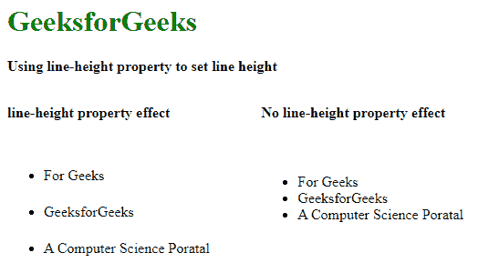
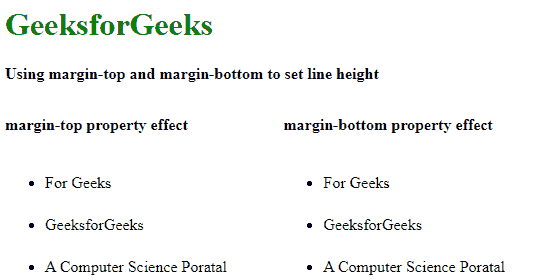
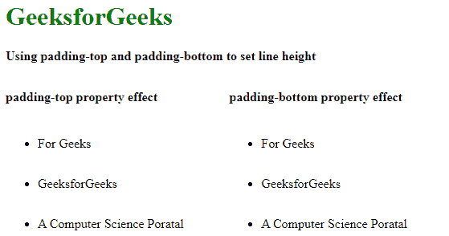

# 如何使用 CSS 设置项目列表之间的垂直间距？

> 原文:[https://www . geeksforgeeks . org/如何使用 css 设置项目列表之间的垂直间距/](https://www.geeksforgeeks.org/how-to-set-vertical-space-between-the-list-of-items-using-css/)

HTML 中的项目列表可以是多种类型，如**有序列表**、**无序列表**或**描述列表**。默认情况下，项目列表之间有固定的垂直间距。我们可以通过使用不同的 CSS 属性来增加或减少项目列表的垂直间距。在本文中，我们将介绍设置项目列表之间垂直间距的所有可能方法。

**[CSS 行高属性:](https://www.geeksforgeeks.org/css-line-height-property/)** 在这个方法中，我们将设置列表项的行高，最终会增加或减少列表项的垂直间距。

*   **语法:**

    ```css
    line-height: normal|number|length|percentage|initial|inherit;
    ```

*   **例:**

    ```css
    <!DOCTYPE html>
    <html lang="en">

    <head>
        <meta charset="UTF-8">
        <meta name="viewport" 
              content="width=device-width, 
                       initial-scale=1.0">
        <title>
            Using line-height to
            set line-height
        </title>

        <style>
            .container {
                width: 500px
            }
            h1 {
                color: green;
            }
            b {
                position: absolute;
                top: 20%;
            }
            .left ul {

                /* Increase line-height 
                   compare to default */
                line-height: 2.5em;
                float: left;
            }
            .right {
                float: right;
            }
        </style>

    </head>

    <body>
        <div class="container">
            <h1>GeeksforGeeks</h1>
            <h4>
                Using line-height property
                to set line height
            </h4>
            <br><br>
            <div class="left">
                <b>line-height property effect</b><br>
                <ul>
                    <li>For Geeks</li>
                    <li>GeeksforGeeks</li>
                    <li>A Computer Science Poratal</li>
                </ul>
            </div>
            <div class="right">
                <b>No line-height property effect</b><br>
                <ul>
                    <li>For Geeks</li>
                    <li>GeeksforGeeks</li>
                    <li>A Computer Science Poratal</li>
                </ul>
            </div>
        </div>
    </body>

    </html>
    ```

*   **输出:** 

**[CSS 页边距顶端属性](https://www.geeksforgeeks.org/css-margin-top-property/) :** 我们将应用页边距顶端属性，该属性将设置列表项的行高，最终将增加或减少列表项的垂直间距。 **[CSS 边距-底部](https://www.geeksforgeeks.org/css-margin-bottom-property/)** 属性也可以适用。
**注意:**也可以只使用 **[CSS 边距属性](https://www.geeksforgeeks.org/css-margins-padding/)** 。

*   **语法:**

    ```css
    For margin-top
    margin-top: length|auto|initial|inherit|percentage;
    ```

    ```css
    For margin-bottom
    margin-bottom: length|auto|initial|inherit|percentage;

    ```

*   **expmle:**

    ```css
    <!DOCTYPE html>
    <html lang="en">

    <head>
        <meta charset="UTF-8">
        <meta name="viewport" 
              content="width=device-width, 
                       initial-scale=1.0">
        <title>
            Using margin-top and margin-bottom
            to set line height
        </title>

        <style>
            .container {
                width: 500px
            }
            h1 {
                color: green;
            }
            b {
                position: absolute;
                top: 20%;
            }
            .left  {

                float: left;
            }
            .right {

                float: right;
            }

            li:not(:first-of-type) {
                margin-top: 1.5em;
            }

            li:not(:last-of-type) {
                margin-bottom: 1.5em;
            }
        </style>

    </head>

    <body>
        <div class="container">
            <h1>GeeksforGeeks</h1>
            <h4>
                Using margin-top and margin-bottom
                to set line height
            </h4>
            <br><br>
            <div class="left">
                <b>margin-top property effect</b><br>
                <ul>
                    <li>For Geeks</li>
                    <li>GeeksforGeeks</li>
                    <li>A Computer Science Poratal</li>
                </ul>
            </div>
            <div class="right">
                <b>margin-bottom property effect</b><br>
                <ul>
                    <li>For Geeks</li>
                    <li>GeeksforGeeks</li>
                    <li>A Computer Science Poratal</li>
                </ul>
            </div>
        </div>
    </body>

    </html>
    ```

*   **输出:** 

**[CSS 填充-top 属性](https://www.geeksforgeeks.org/css-padding-top-property/) :** 我们将应用填充-top 属性，该属性将设置列表项的行高，最终将增加或减少列表项的垂直间距。 **[CSS 填充-底部属性](https://www.geeksforgeeks.org/css-padding-bottom-property/)** 也适用。
**注意:**也可以只使用 **[CSS 填充属性](https://www.geeksforgeeks.org/css-margins-padding/)** 。

*   **语法:**

    ```css
    For padding-top
    padding-top: length|initial|inherit;
    ```

    ```css
    For padding-bottom
    padding-bottom: length|initial|inherit;
    ```

*   **例:**

    ```css
    <!DOCTYPE html>
    <html lang="en">

    <head>
        <meta charset="UTF-8">
        <meta name="viewport" 
              content="width=device-width, 
                       initial-scale=1.0">
        <title>
            Using padding-top and padding-bottom
            to set line height
        </title>

        <style>
            .container {
                width: 500px
            }
            h1 {
                color: green;
            }
            b {
                position: absolute;
                top: 20%;
            }
            .left  {

                float: left;
            }
            .right {

                float: right;
            }

            li:not(:first-of-type) {
                padding-top: 1.0em;
            }

            li:not(:last-of-type) {
                padding-bottom: 1.0em;
            }
        </style>

    </head>

    <body>
        <div class="container">
            <h1>GeeksforGeeks</h1>
            <h4>
                Using padding-top and padding-bottom
                to set line height
            </h4>
            <br><br>
            <div class="left">
                <b>padding-top property effect</b><br>
                <ul>
                    <li>For Geeks</li>
                    <li>GeeksforGeeks</li>
                    <li>A Computer Science Poratal</li>
                </ul>
            </div>
            <div class="right">
                <b>padding-bottom property effect</b><br>
                <ul>
                    <li>For Geeks</li>
                    <li>GeeksforGeeks</li>
                    <li>A Computer Science Poratal</li>
                </ul>
            </div>
        </div>
    </body>

    </html>
    ```

*   **输出:** 

    **注意:**所有方法中的垂直间距会有所不同。