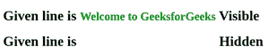
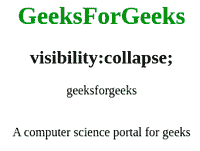

# 如何在 CSS 中设置元素的可见性属性？

> 原文:[https://www . geeksforgeeks . org/如何设置 css 中元素的可见性属性/](https://www.geeksforgeeks.org/how-to-set-visibility-property-of-an-element-in-css/)

[**可见属性**](https://www.geeksforgeeks.org/css-visibility-property/) 用于指定一个元素在 web 文档中是否可见，但是隐藏的元素会占用 web 文档中的空间。您可以使用相同的可见属性设置 CSS 中元素的可见属性。

通过可见性属性，我们可以让图像、文本、框等元素**肉眼可见**，甚至可以**隐藏。**要隐藏表格元素，您可以使用**折叠，**，这将在本文中进一步讨论。

**语法:**

```css
visibility: visible | hidden | collapse | initial | inherit;
```

**属性值:**

*   **可见:**为默认值。该元素在 web 文档中是显示的或通常可见的。
*   **隐藏:**该属性隐藏页面中的元素，但会占用文档中的空间。
*   **折叠:**此属性仅用于表格元素，以从表格中移除行和列。

**示例 1:** 使用可见和隐藏属性值。

## 超文本标记语言

```css
<!DOCTYPE html>
<html>
<head>
    <style>
        .line1 {
            color: green;
            /* visible value to make element visible */
            visibility: visible;
        }

        .line2 {
            color: green;
            /* hidden value to hide elements from user. */
            visibility: hidden;
        }
    </style>

</head>

<body>
    <h1>
        Given line is <small class="line1">
        Welcome to GeeksforGeeks</small> Visible
    </h1>
    <h1>
        Given line is <small class="line2">
        Welcome to GeeksforGeeks</small> Hidden
    </h1>
</body>

</html>
```

**输出:**



**示例 2:** 使用折叠属性值。

## 超文本标记语言

```css
<!DOCTYPE html>
<html>

<head>
    <style>
            table.geeks {
            /* collapse value to delete row and
               column from table */
            visibility: collapse
        }

        table,
        th,
        td {
            border: 1px solid red;
            p {
                color: green;
                font-size: 25px;
            }
    </style>
</head>

<body>
    <center>
        <h1 style="color:green;">GeeksForGeeks</h1>
        <h2>visibility:collapse;</h2>

<p>geeksforgeeks</p>

        <!---table tag to form table --->
        <table style="border:1px solid red;" class="geeks">
            <tr>
                <th>geeks</th>
                <th>for</th>
                <th>geeks</th>
            </tr>
        </table>

<p>A computer science portal for geeks</p>

    </center>
</body>

</html>
```

**输出:**



**支持的浏览器:**

*   谷歌 Chrome
*   微软公司出品的 web 浏览器
*   火狐浏览器
*   歌剧
*   狩猎