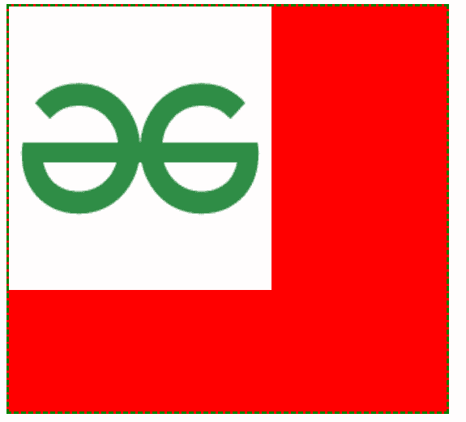
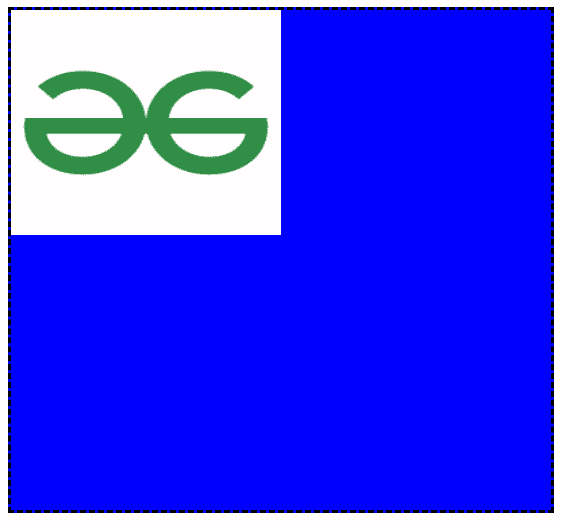

# 如何在 CSS 中设置背景图像相对于父元素的宽度和高度，以百分比表示？

> 原文:[https://www . geesforgeks . org/如何设置背景图像相对于 css 中父元素的宽度和高度百分比/](https://www.geeksforgeeks.org/how-to-set-width-and-height-of-background-image-in-percent-with-respect-to-parent-element-in-css/)

如果我们将图像作为子图像使用，并且想要以百分比设置高度和宽度，那么我们需要将父元素设置为某个固定的大小。

**方法 1:**

*   这里我们将在标签中使用 CSS，也称为**内联 CSS** 。
*   对于父 div，我们会根据屏幕大小给出**高度:500px** 和**宽度:40%** 的固定尺寸，我们会给它背景色和边框，让父 div 清晰可见。
*   现在对于儿童形象，我们将给出**宽度:60%****高度:70%。**

## 超文本标记语言

```css
<!DOCTYPE html>
<html>

<body>
    <div style="height: 500px; width: 40%; 
        background-color: red; 
        border-color: green; 
        border-style: dashed;">

        
    </div>
</body>

</html>
```

**输出:**



**方法 2:**

*   这里我们将编写样式标签中的 CSS，也称为内联 CSS。
*   现在我们将通过给它**高度:500px** 和**宽度:40%** 来给父对象固定的尺寸，并且为了清楚地定义父对象，我们将给出边框颜色和背景颜色。
*   最后，我们将给出图像**宽度:50%****高度:45%** 。

## 超文本标记语言

```css
<!DOCTYPE html>
<html>

<head>
    <style>
        /* giving parent fix size  */

        div {
            height: 500px;
            width: 40%;
            background-color: blue;
            border-color: black;
            border-style: dashed;
        }
        /* child having size in % */

        img {
            width: 50%;
            height: 45%;
        }
    </style>
</head>

<body>
    <div>
        
    </div>
</body>

</html>
```

**输出:**

