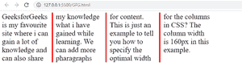

# 如何在 CSS 中设置列间规则的宽度样式和颜色？

> 原文:[https://www . geesforgeks . org/如何设置 css 中各列之间的宽度样式和颜色规则/](https://www.geeksforgeeks.org/how-to-set-width-style-and-color-of-rule-between-columns-in-css/)

在本文中，我们将学习如何指定列间规则的宽度、样式和颜色。

**方法:****列规则**属性用于指定列间规则的宽度、样式和颜色。它采用三个值:规则宽度、规则样式和规则颜色。

**语法:**

```html
column-rule: width style color;
```

**例 1:**

## 超文本标记语言

```html
<!DOCTYPE html>
<html lang="en">

<head>
    <style>
        .gfg {
            font-size: 30px;
            column-width: 160px;
            column-rule: 5px solid red;
        }
    </style>
</head>

<body>
    <div class="parent" style="width: 50%;">
        <div class="gfg">
            GeeksforGeeks is my favorite site 
            where I can gain a lot of knowledge 
            and can also share my knowledge what 
            I have gained while learning. We can 
            add more paragraphs for content. 
            This is just an example to tell you 
            how to specify the optimal width for
            the columns in CSS? The column width 
            is 160px in this example.
        </div>
    </div>
</body>

</html>
```

**输出:**



**例 2:**

## 超文本标记语言

```html
<!DOCTYPE html>
<html lang="en">
  <head>
    <style>
        .gfg{
          font-size: 30px;
          column-width: 160px;
          column-rule: 5px dotted blue;
        }
    </style>
  </head>
  <body>
    <div class="parent" style="width: 50%;">
      <div class="gfg">
        GeeksforGeeks is my favorite site where 
        I can gain a lot of knowledge and can
        also share my knowledge what I have gained 
        while learning. We can add more 
        paragraphs for content. This is just an 
        example to tell you how to specify 
        the optimal width for the columns in CSS? The 
        column width is 160px in this example. 
      </div>
    </div>
  </body>
</html>
```

**输出:**

