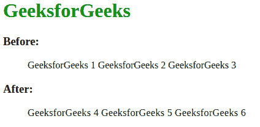

# 使用 CSS 悬停文本加粗时如何移动内嵌元素？

> 原文:[https://www . geeksforgeeks . org/how-shift-inline-elements-when-text-bold-on-hover-use-CSS/](https://www.geeksforgeeks.org/how-to-shift-inline-elements-when-text-bold-on-hover-using-css/)

当我们将使用 **a:悬停**伪类来为内联元素添加加粗效果时，我们观察到每当我们用鼠标悬停在元素上时，鼠标右侧的元素都会向右移动。这不是一个好的用户体验，因此需要删除。

我们可以使用字母间距 CSS 属性来解决这个问题，并制作非移位的内联元素。**字母间距**是一个 CSS 属性，用于增加或减少文本中字符之间的间距。这个 CSS 属性可以用来防止内联元素的移动，当我们将鼠标悬停在它们上面时，内联元素会变得加粗。下面是问题的工作示例和解决方法。

*   **语法:**

    ```css
     .class_name { letter-spacing: value }
    ```

*   **例:**

    ```css
    <!DOCTYPE hyml>
    <html>

    <head>
        <style>
            li {
                list-style: none;
                display: inline;
            }

            .nav a {
                letter-spacing: 0.36px;
            }

            li a:link,
            li a:visited {
                text-decoration: none;
                color: #000;
            }

            li a:hover {
                text-decoration: none;
                font-weight: bold;
            }

            .nav li a:hover {
                text-decoration: none;
                font-weight: bold;
                letter-spacing: 0;
            }
        </style>
    </head>

    <body>
        <h3>Before:</h3>
        <ul>
            <li><a href="#">GeeksforGeeks 1</a></li>
            <li><a href="#">GeeksforGeeks 2</a></li>
            <li><a href="#">GeeksforGeeks 3</a></li>
        </ul>
        <h3>After:</h3>
        <ul class="nav">
            <li><a href="#">GeeksforGeeks 4</a></li>
            <li><a href="#">GeeksforGeeks 5</a></li>
            <li><a href="#">GeeksforGeeks 6</a></li>
        </ul>

        <body>

    </html>                
    ```

*   **输出:**
    