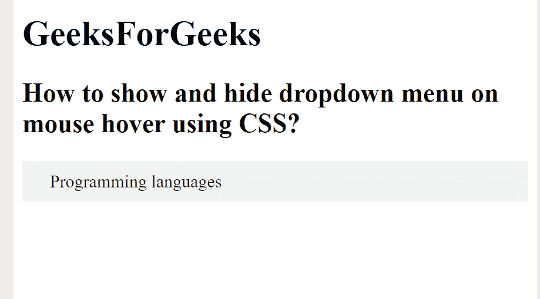
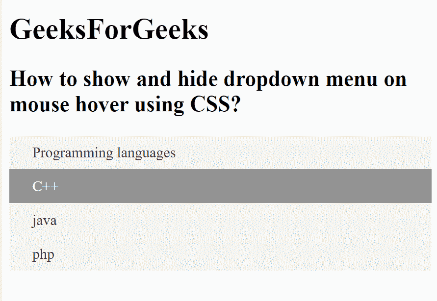

# 如何使用 CSS 显示/隐藏鼠标悬停时的下拉菜单？

> 原文:[https://www . geesforgeks . org/how-show-hide-下拉菜单-鼠标悬停-使用-css/](https://www.geeksforgeeks.org/how-to-show-hide-dropdown-menu-on-mouse-hover-using-css/)

本文的方法是使用 CSS 显示和隐藏鼠标悬停时的下拉菜单。使用 **[显示属性](https://www.geeksforgeeks.org/css-display-property/)** 和 **[:悬停选择器](https://www.geeksforgeeks.org/css-hover-selector/)** 即可完成任务。

**示例:**

## 超文本标记语言

```css
<!DOCTYPE html>
<html lang="en">

<head>
    <title>
        How to Show Hide Dropdown Using CSS
    </title>

    <style>
        ul {
            padding: 0;
            list-style: none;
            background: #f2f2f2;
        }

        ul li {
            display: block;
            position: relative;
            line-height: 21px;
            text-align: left;
        }

        ul li a {
            display: block;
            padding: 8px 25px;
            color: #333;
            text-decoration: none;
        }

        ul li a:hover {
            color: #fff;
            background: #939393;
        }

        ul li ul.dropdown {
            min-width: 100%;
            /* Set width of the dropdown */
            background: #f2f2f2;
            display: none;
            position: absolute;
            z-index: 999;
            left: 0;
        }

        ul li:hover ul.dropdown {
            display: block;
            /* Display the dropdown */
        }
    </style>
</head>

<body>
    <h1>
        GeeksForGeeks
    </h1>

    <h2>
        How to show and hide dropdown
        menu on mouse hover using CSS?
    </h2>

    <ul>
        <li>
            <a href="#">Programming languages</a>
            <ul class="dropdown">
                <li><a href="#">C++</a></li>
                <li><a href="#">java</a></li>
                <li><a href="#">php</a></li>
            </ul>
        </li>
    </ul>

</body>

</html>
```

**输出:**

**将鼠标悬停在下拉菜单上之前:**



将鼠标悬停在下拉菜单上后:



**支持的浏览器如下:**

*   谷歌 Chrome
*   微软公司出品的 web 浏览器
*   火狐浏览器
*   歌剧
*   旅行队