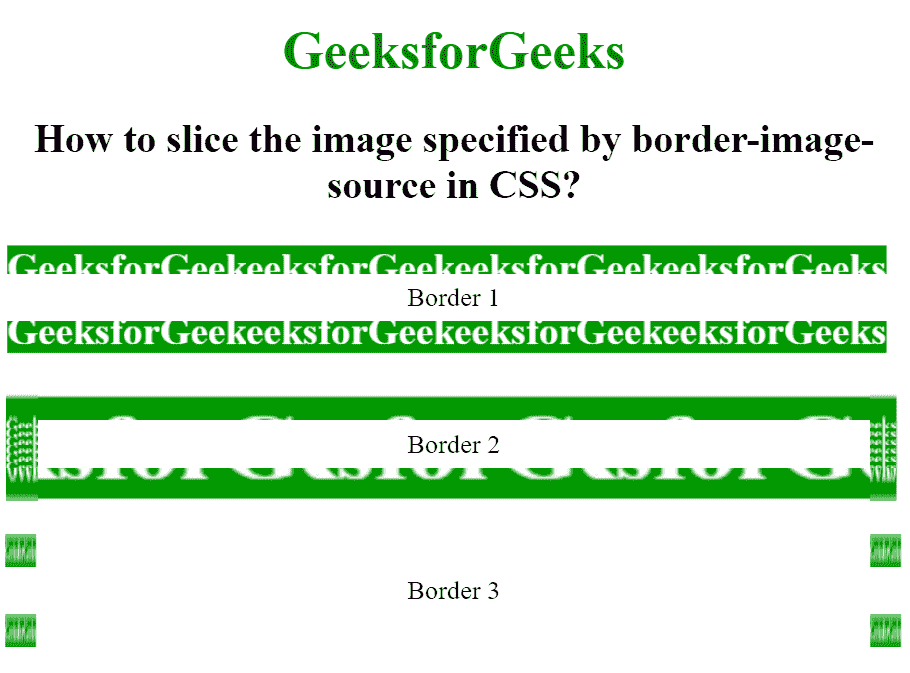

# 如何在 CSS 中对边框-图像-来源指定的图像进行切片？

> 原文:[https://www . geeksforgeeks . org/如何通过边框指定图像-图像-css 中的源/](https://www.geeksforgeeks.org/how-to-slice-image-specified-by-border-image-source-in-css/)

在本文中，我们将看到如何使用 CSS 将边框图像添加为切片图像。为了制作边界切片图像，使用了边界图像切片属性。此属性分割或切片由边框-图像-源属性指定的图像。

边框图像切片属性将给定的图像分成–

*   9 个地区
*   4 个角
*   4 条边
*   中部地区

下图显示了上述区域:


*   区域 1、3、7、9 是拐角区域。
*   区域 2、4、6、8 是边缘区域。
*   区域 5 是中间区域。

**语法:**

```html
border-image-slice= Number | Percent 
   | fill | Initial | Inherit;
```

**示例:**

## 超文本标记语言

```html
<!DOCTYPE html>
<html>

<head>
    <title>
        How to slice the image specified by
        border-image-source in CSS?
    </title>

    <style>
        body {
            text-align: center;
        }

        h1 {
            color: green;
        }

        .border1 {
            border: 10px solid transparent;
            padding: 15px;
            border-image-source: url(
https://media.geeksforgeeks.org/wp-content/uploads/border1-2.png);
            border-image-repeat: round;
            border-image-slice: 30;
            border-image-width: 20px;
        }

        .border2 {
            border: 10px solid transparent;
            padding: 15px;
            border-image-source: url(
https://media.geeksforgeeks.org/wp-content/uploads/border1-2.png);
            border-image-repeat: round;
            border-image-slice: 30%;
            border-image-width: 20px;
        }

        .border3 {
            border: 10px solid transparent;
            padding: 15px;
            border-image-source: url(
https://media.geeksforgeeks.org/wp-content/uploads/border1-2.png);
            border-image-repeat: round;
            border-image-slice: fill;
            border-image-width: 20px;
        }

        div {
            margin-top: 20px;
        }
    </style>
</head>

<body>
    <h1>GeeksforGeeks</h1>
    <h2>
        How to slice the image specified
        by border-image-source in CSS?
    </h2>

    <div class="border1">Border 1</div>
    <div class="border2">Border 2</div>
    <div class="border3">Border 3</div>
</body>

</html>
```

**输出:**

