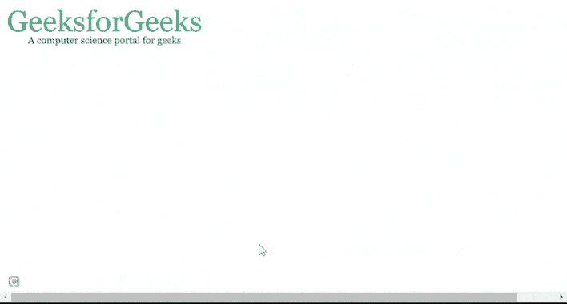

# 如何使用 jQuery 平滑过渡 CSS 背景图像？

> 原文:[https://www . geesforgeks . org/如何平滑过渡-CSS-背景-图像-使用-jquery/](https://www.geeksforgeeks.org/how-to-smoothly-transition-css-background-images-using-jquery/)

在本文中，我们将学习使用 jQuery 和 CSS 实现背景图像的平滑过渡。

**进场:**

*   首先，我们使用样式标签中的[**背景图像**](https://www.geeksforgeeks.org/css-background-image-property/) 属性添加一个透明背景图像。

    ```css
    background-image: url(white.jpg);
    ```

*   对于过渡背景图像，我们在 CSS 中使用 [**过渡**](https://www.geeksforgeeks.org/css-transition-property/) 属性，并在样式标签中为背景图像添加一个过渡。

    ```css
    transition: background-image 3s;
    ```

*   在脚本部分，我们创建一个图像对象，并添加需要转换的图像源。在图像加载时，我们使用 JQuery 中的[**css()方法**](https://www.geeksforgeeks.org/jquery-css-method/) 调用一个添加*背景图像*的函数。

**JavaScript 代码片段:**

```css
 var image = new Image();
// Image for transition
image.src = "geek.png";
image.onload = function () {
  $(".element").css("background-image", 
                    "url('" + image.src + "')");
};

```

**示例:**下面是上述方法的完整实现。

## 超文本标记语言

```css
<!DOCTYPE html>
<html>
  <head>
    <!-- JQuery CDN -->
    <script src=
"https://ajax.googleapis.com/ajax/libs/jquery/3.5.1/jquery.min.js">
    </script>
    <style>
      body {
        width: 100%;
        height: 100%;
      }
      .element {
        background-image: url(
https://media.geeksforgeeks.org/wp-content/uploads/20210507170406/white.jpg);
        width: 60%;
        height: 100%;
        padding: 200px;
        background-repeat: no-repeat;
        transition: background-image 3s;
      }
    </style>
  </head>

  <body>
    <div class="element"></div>

    <script>
      var image = new Image();

      // Image for transition
      image.src =
"https://media.geeksforgeeks.org/wp-content/uploads/20210507170600/gfg1-300x67.png";
      image.onload = function () {
        $(".element").css("background-image", 
                          "url('" + image.src + "')");
      };
    </script>
  </body>
</html>
```

**输出:**



平稳过渡