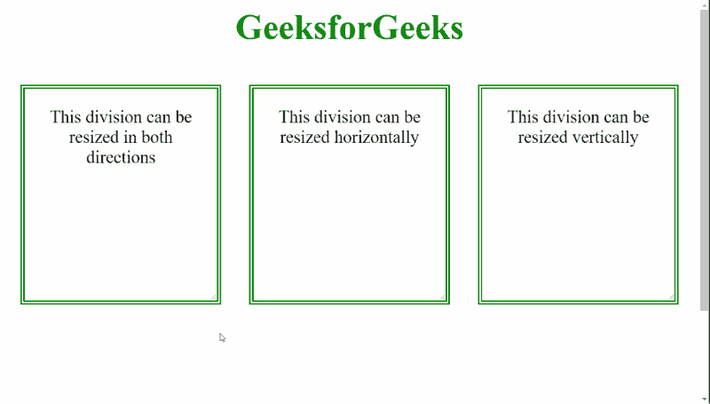

# 如何在 CSS 中指定一个除法元素应该是可调整大小的？

> 原文:[https://www . geeksforgeeks . org/如何在 css 中指定应该调整大小的分割元素/](https://www.geeksforgeeks.org/how-to-specify-a-division-element-should-be-resizable-in-css/)

在本文中，我们将学习如何使用 CSS 指定一个可由用户调整大小的分割元素。

**方法:****调整大小**属性用于定义用户是否可以调整元素的大小。可以用三个值来指定一个元素的大小，即*水平*、*垂直*、*均为*。默认设置为*无*。我们可以指定这些值中的任何一个，使除法可以根据需要调整大小。此外，*溢出*属性必须设置为*自动*，以便正确调整大小。

**语法:**

```html
.resizable {

  /* Enable resize on both 
  horizontal and vertical */
  resize: both;
}
```

**示例:**

## 超文本标记语言

```html
<!DOCTYPE html>
<html>

<head>
    <style>
        body {
            text-align: center;
            font-size: 20px;
        }

        .container {
            display: flex;
            height: 500px;
        }

        .resize-both,
        .resize-hor,
        .resize-ver {
            border: 5px green double;
            padding: 20px;
            width: 200px;
            height: 200px;
            margin: 16px;

            /* Set overflow to auto */
            overflow: auto;
        }

        .resize-both {

            /* Enable resize on both
            horizontal and vertical */
            resize: both;
        }

        .resize-hor {

            /* Enable resize on
            horizontal */
            resize: horizontal;
        }

        .resize-ver {

            /* Enable resize on
            vertical */
            resize: vertical;
        }
    </style>
</head>

<body>
    <h1 style="color:green">
        GeeksforGeeks
    </h1>

    <div class="container">
        <div class="resize-both">
            This division can be resized
            in both directions
        </div>

        <div class="resize-hor">
            This division can be
            resized horizontally
        </div>

        <div class="resize-ver">
            This division can be
            resized vertically
        </div>
    </div>
</body>

</html>
```

**输出:**

