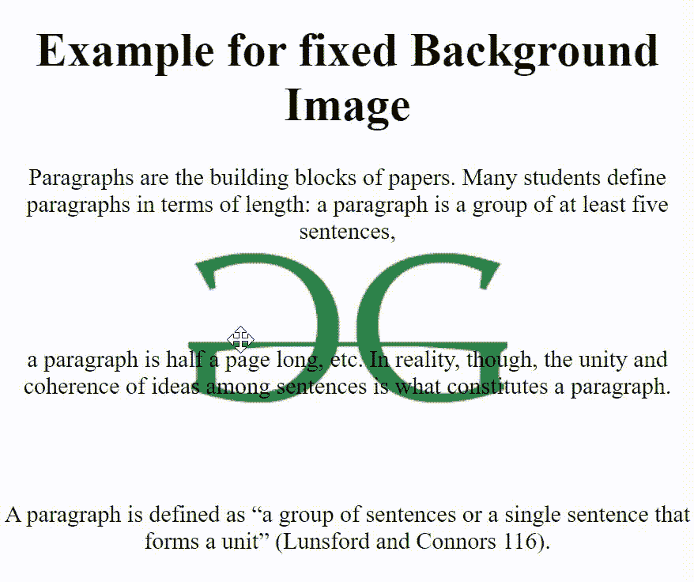

# 如何在 CSS 中指定固定的背景图像？

> 原文:[https://www . geeksforgeeks . org/如何指定固定背景图片中的 css/](https://www.geeksforgeeks.org/how-to-specify-a-fixed-background-image-in-css/)

在本文中，我们将看到如何在 CSS 中指定一个固定的背景图像。为了在 CSS 中保持背景固定、滚动或局部，我们必须使用背景-附件属性。

[**背景-附件**](https://www.geeksforgeeks.org/css-background-attachment-property/) **:** 这个属性在 CSS 中用来设置背景图像为固定或滚动。此属性的默认值是滚动。

背景附件属性的值:

*   **滚动:**是背景-附件属性的默认值。它用于滚动带有背景页的图像。
*   **修正:**背景图像不会滚动。它与页面固定在一起。
*   **本地:**背景图像会随着内容滚动。

要保持背景图像固定，必须使用值为“固定”的背景附件属性。

**语法:**

```css
background-attachment: fixed;
```

**示例:**

## 超文本标记语言

```css
<!DOCTYPE html>
<html>

<head>
    <style type="text/css">
        h1 {
            text-align: center;
        }

        #ex {
            text-align: center;
            background-image:
url("https://media.geeksforgeeks.org/wp-content/uploads/geeks-25.png");
            background-position: center;
            background-repeat: no-repeat;
            background-attachment: fixed;
        }
    </style>
</head>

<body>

    <h1>Example for fixed Background Image</h1>

    <div id="ex">

<p>
            Paragraphs are the building blocks
            of papers. Many students define
            paragraphs in terms of length: a
            paragraph is a group of at least
            five sentences,
        </p>

        <br><br>

<p>
            a paragraph is half a page long,
            etc. In reality, though, the unity
            and coherence of ideas among
            sentences is what constitutes a
            paragraph.
        </p>

        <br><br>

<p>
            A paragraph is defined as “a group
            of sentences or a single sentence
            that forms a unit” (Lunsford and
            Connors 116).
        </p>

        <br><br>

<p>
            Length and appearance do not
            determine whether a section in
            a paper is a paragraph.
        </p>

        <br><br>

<p>
            For instance, in some styles of
            writing, particularly journalistic
            styles, a paragraph can be just
            one sentence long. Ultimately, a
            paragraph is a sentence or group of
            sentences that support one main idea.
        </p>

        <br><br>

<p>
            In this handout, we will refer to this
            as the “controlling idea,” because it
            controls what happens in the rest
            of the paragraph.
        </p>

    </div>
</body>

</html>
```

**输出:**



**支持的浏览器:**

*   谷歌 Chrome 1.0
*   Internet Explorer 4.0
*   Firefox 1.0
*   歌剧 3.5
*   Safari 1.0