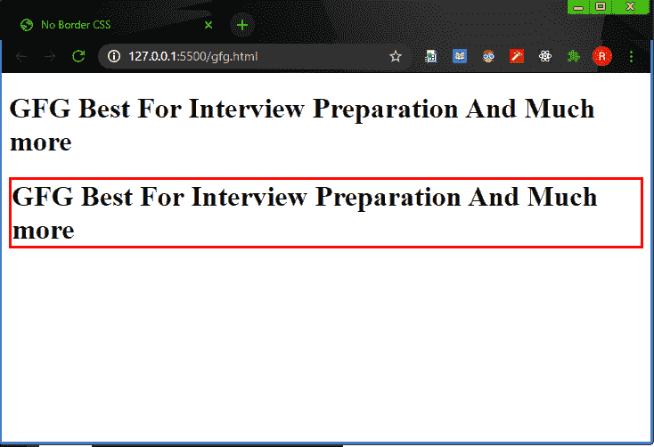
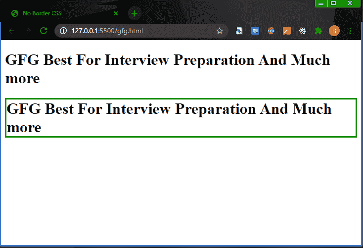

# 如何在 CSS 中指定无边框？

> 原文:[https://www . geesforgeks . org/how-to-no-border-in-CSS/](https://www.geeksforgeeks.org/how-to-specify-no-border-in-css/)

我们可以使用 CSS ***指定无边框属性:无，边框宽度:0，边框:0*** 属性。

**方法 1:**

*   我们将为两个标题赋予[](https://www.geeksforgeeks.org/css-border-color-property/)*、 [*边框样式的*](https://www.geeksforgeeks.org/css-border-style-property/) 属性，用于显示有边框和无边框的文本。*
*   *对于无边框标题，我们将使用[*边框宽度:0*](https://www.geeksforgeeks.org/css-border-width-property/) ，这将导致无边框。*

***示例:***

## *超文本标记语言*

```css
*<!DOCTYPE html>
<html>
<head>
   <title>No Border CSS</title>
</head>
<body>
 <h1 style="border-color : red ;
            border-style : solid ;
            border-width : 0">GFG Best For Interview Preparation And Much more</h1>
 <h1 style="border-color : red ;
            border-style : solid ;">GFG Best For Interview Preparation And Much more</h1>
</body>
</html>*
```

***输出:***

*

没有边界* 

***方法 2 :***

*   *我们将为两个标题赋予 [*边框颜色*](https://www.geeksforgeeks.org/css-border-color-property/) 、 [*边框样式*](https://www.geeksforgeeks.org/css-border-style-property/) 属性，用于显示有边框和无边框的文本。*
*   *对于无边框标题，我们将使用[*边框:0*](https://www.geeksforgeeks.org/css-border-width-property/) ，这将导致无边框。*

***示例:***

## *超文本标记语言*

```css
*<!DOCTYPE html>
<html>
<head>
  <title>No Border CSS</title>
</head>
<body>
 <h1 style="border-color : green ;
            border-style : solid ;
            border : 0">GFG Best For Interview Preparation And Much more</h1>
 <h1 style="border-color : green ;
            border-style : solid ;">GFG Best For Interview Preparation And Much more</h1>
</body>
</html>*
```

***输出:***

*

没有边界* 

***进场 3:***

*   *我们将为两个标题赋予 [*边框颜色*](https://www.geeksforgeeks.org/css-border-color-property/) 、 [*边框样式*](https://www.geeksforgeeks.org/css-border-style-property/) 属性，用于显示有边框和无边框的文本。*
*   *对于无边框标题，我们将使用*边框* : *无*，这将导致无边框。*

***示例:***

## *超文本标记语言*

```css
*<!DOCTYPE html>
<html>
<head>
 <title>No Border CSS</title>
</head>
<body>
 <h1 style="border-color : green ;
            border-style : solid ;
            border : none">GFG Best For Interview Preparation And Much more</h1>
 <h1 style="border-color : green ;
            border-style : solid ;">GFG Best For Interview Preparation And Much more</h1>
</body>
</html>*
```

***输出:***

*

没有边界*