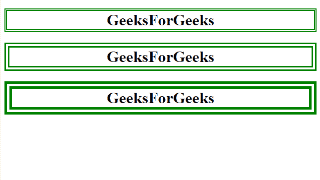

# 如何用 CSS 指定双边框？

> 原文:[https://www . geeksforgeeks . org/如何使用-css/](https://www.geeksforgeeks.org/how-to-specify-the-double-border-using-css/) 指定双边框

任务是使用 CSS 指定双边框。在本文中，我们将使用边框样式属性来设置边框的样式。

**使用的属性:**

*   [**边框样式属性**](https://www.geeksforgeeks.org/css-border-style-property/) **:** 该属性用于设置元素四个边框的样式。

**进场:**

*   用一些元素创建网页。
*   现在，使用边框样式属性将边框设置为双精度值。

**示例:**

## 超文本标记语言

```
<!DOCTYPE html>
<html>
<head>
    <style type="text/css">
        body {
            text-align: center;
        }

        h1.double {
            border-width: 5px;
            border-style: double;
            Border-color: green
        }

        h1.double2 {
            border-width: 10px;
            border-style: double;
            Border-color: green
        }

        h1.double3 {
            border-width: 15px;
            border-style: double;
            Border-color: green
        }
    </style>
</head>

<body>
    <h1 class="double">GeeksForGeeks</h1>
    <h1 class="double2">GeeksForGeeks</h1>
    <h1 class="double3">GeeksForGeeks</h1>
</body>

</html>
```

**输出:**

