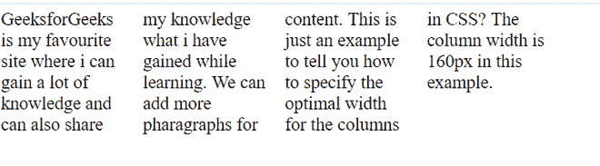
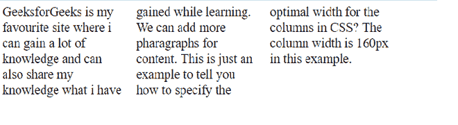

# 如何在 CSS 中指定列的最佳宽度？

> 原文:[https://www . geeksforgeeks . org/如何为 css 中的列指定最佳宽度/](https://www.geeksforgeeks.org/how-to-specify-the-optimal-width-for-the-columns-in-css/)

在本文中，我们将学习为 CSS 中的列指定最佳宽度。CSS 的*列宽*属性用于指定列的最佳宽度。

**方法:**我们可以使用 *[列宽](https://www.geeksforgeeks.org/css-column-width-property/)* 属性为 CSS 中的列指定最佳宽度。我们为列宽设置一个值，所有列宽都不小于指定值。

**语法:**

```html
column-width: value;
```

**示例 1:****后面的示例演示了设置*列宽*属性**。**输出结果为四列内容。**

## **超文本标记语言**

```html
<!DOCTYPE html>
<html lang="en">
  <head>
    <style>
        .gfg{
          font-size: 30px;
          column-width: 160px;
        }
    </style>
  </head>
  <body>
    <div class="parent" style="width:50%;">
      <div class="gfg">
        GeeksforGeeks is my favourite site where 
        i can gain a lot of knowledge and can
        also share my knowledge what i have gained
        while learning. We can add more 
        pharagraphs for content. This is just an 
        example to tell you how to specify 
        the optimal width for the columns in CSS? 
        The column width is 160px in this example. 
      </div>
    </div>
  </body>
</html>
```

****输出:****

****

****示例 2:** 以下示例演示了为文本内容设置属性，如*列数*和*列宽*。**

## **超文本标记语言**

```html
<!DOCTYPE html>
<html lang="en">
  <head>
    <style>
        .gfg{
          font-size: 30px;
          column-count: 3;
          column-width: 160px;
        }
    </style>
  </head>
  <body>
    <div class="parent" style="width: 50%;">
      <div class="gfg">
        GeeksforGeeks is my favourite site where 
        i can gain a lot of knowledge and can
        also share my knowledge what i have 
        gained while learning. We can add more 
        pharagraphs for content. This is just 
        an example to tell you how to specify 
        the optimal width for the columns in CSS? 
        The column width is 160px in this example. 
      </div>
    </div>
  </body>
</html>
```

****输出:****

**

列宽和列数**