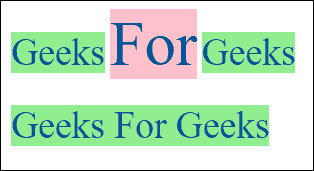
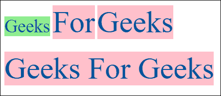

# 如何指定 CSS 中类的顺序？

> 原文:[https://www . geesforgeks . org/如何指定 css 中的类顺序/](https://www.geeksforgeeks.org/how-to-specify-the-order-of-classes-in-css/)

当有相互冲突的规则被应用到给定的元素时，确定哪个规则将被实际应用变得相当复杂。
属性被覆盖的顺序由它们在 CSS 中出现的位置决定，而不是由类属性中定义类的顺序决定，即在 CSS 类的末尾定义的样式将是要应用的样式。
因此，如果两个声明具有相同的权重、来源和特异性，则指定的后者获胜。

**示例 1:** 本示例显示四个具有唯一类别的标签。当我们看到标签有订单*“基本额外”*或*“额外基本”*时，两者都遵循*的样式。基本*放置在造型顺序的末尾。

```css
<html>
<head>
<style type="text/css">
    .extra {
        color: #00529B;
        font-size:50px;        
        background-color: pink;
    }

    .basic {

           color: #00529B;
           font-size:30px;        
        background-color: #90ee90; /*light green*/
    }
</style>
</head>
<body>
    <label class="basic"/>Geeks</label>
    <label class="extra"/>For</label>
    <label class="basic extra"/>Geeks</label>
    <br/>
    <br/>
    <label class="extra basic"/>Geeks For Geeks</label>    
</body>
</html>
```

**输出:**


**示例:**
该示例显示了四个具有唯一类的标签，如上所述，但是我们颠倒了定义样式的顺序。当我们看到标签的顺序为*“基本额外”*或*“额外基本”*时，两者都遵循如下样式。额外放置在造型顺序的末尾。

```css
<html>
<head>
<style type="text/css">

    .basic {

        color: #00529B;
        font-size:30px;     
        background-color: #90ee90; /*light green*/
    }

    .extra {
        color: #00529B;
        font-size:50px;     
        background-color: pink;
    }

</style>
</head>
<body>
    <label class="basic"/>Geeks</label>
    <label class="extra"/>For</label>
    <label class="basic extra"/>Geeks</label>
    <br/>
    <br/>
    <label class="extra basic"/>Geeks For Geeks</label> 
</body>
</html>
```

**输出:**
