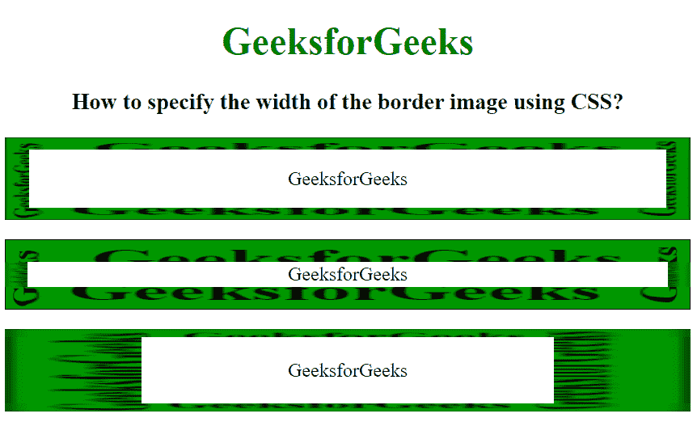

# 如何用 CSS 指定边框图像的宽度？

> 原文:[https://www . geeksforgeeks . org/如何使用 css 指定图像边框宽度/](https://www.geeksforgeeks.org/how-to-specify-the-width-of-the-border-image-using-css/)

在本文中，我们将使用 CSS 设置边框图像的宽度。要设置边框图像的宽度，我们使用 CSS 边框-图像-宽度属性。

边框图像宽度属性用于设置边框图像的宽度。可以通过提供多个值来设置。

*   如果只提供一个值，它将应用于所有四个边。
*   当指定两个值时，第一个值应用于“顶部和底部”，第二个值应用于“左侧和右侧”。
*   当指定三个值时，第一个值位于顶部，第二个值由“左”和“右”共享，第三个值位于底部。
*   如果给定了四个值，那么它们将应用于顶部、右侧、底部和左侧(顺时针)顺序。

**语法:**

```css
border-image-width: number | % | auto | initial | inherit;
```

**示例:**

## 超文本标记语言

```css
<!DOCTYPE html>
<html lang="en">

<head>
    <title>
        How to specify the width of
        the border image using CSS?
    </title>

    <style>
        body {
            text-align: center;
        }

        h1 {
            color: green;
        }

        #geek1 {
            border: 10px solid transparent;
            padding: 15px;
            border-image-source:
                url(
https://media.geeksforgeeks.org/wp-content/uploads/border2-2.png);
            border-image-slice: 30;
            border-image-width: 10px 20px;
        }

        #geek2 {
            border: 10px solid transparent;
            padding: 10px;
            border-image-source:
                url(
https://media.geeksforgeeks.org/wp-content/uploads/border2-2.png);
            border-image-slice: 30;
            border-image-width: 1.2rem;
        }

        #geek3 {
            border: 10px solid transparent;
            padding: 15px;
            border-image-source:
                url(
https://media.geeksforgeeks.org/wp-content/uploads/border2-2.png);
            border-image-slice: 30;
            border-image-width: 10% 20% 10% 20%;
        }
    </style>
</head>

<body>
    <h1>GeeksforGeeks</h1>

    <h3>
        How to specify the width of
        the border-image using CSS?
    </h3>

    <p id="geek1">GeeksforGeeks</p>

    <p id="geek2">GeeksforGeeks</p>

    <p id="geek3">GeeksforGeeks</p>

</body>

</html>
```

**输出:**

