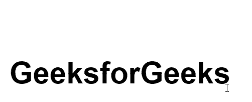

# 如何使用 CSS 在鼠标移动时水平拆分文本？

> 原文:[https://www . geeksforgeeks . org/如何使用 css 水平移动鼠标拆分文本/](https://www.geeksforgeeks.org/how-to-split-text-horizontally-on-mouse-move-over-using-css/)

鼠标移动时的文本拆分也称为“拆分”效果或“断开”效果。这种效果在过去的网页设计中非常流行，但是现在随着新的网页设计模式的出现，它开始失去它的位置。

**方式:**方式是使用之前的[和](https://www.geeksforgeeks.org/css-before-selector/)之后的[选择器将文本拆分为两部分。然后我们将使用](https://www.geeksforgeeks.org/css-after-selector/)[悬停](https://www.geeksforgeeks.org/css-hover-selector/)选择器使效果仅在鼠标悬停时可见。现在，让我们看看上述方法的实现。

**HTML 代码:**HTML 代码用于创建身体的结构。在下面的代码中，一个< h1 >元素用于在屏幕上书写文本。

```html
<!DOCTYPE html>
<html lang="en">

<head>
    <meta charset="UTF-8">
    <meta name="viewport" content=
        "width=device-width, initial-scale=1.0">

    <title>Split Effect </title>
</head>

<body>
    <h1 data-title="GeeksforGeeks">
        GeeksforGeeks
    </h1>
</body>

</html>
```

**CSS 代码:**

*   **步骤 1:** 首先，我们已经将文本对齐到中心，并为其提供字体大小和基本样式。
*   **第二步:**我们已经使用了 before 选择器使文本的上半部分为白色。
*   **第三步:**然后使用 after selector 来覆盖我们使用 before selector 创建的白色区域，以便我们可以在稍后使用悬停来揭开它。
*   **第四步:**现在使用悬停来揭开鼠标悬停的效果。

**提示:**可以使用不同的 z-index 值，确保顺序不变，代码中使用的边距值可以根据文本的字体大小进行调整。确保将相同的值应用于悬停中使用的*边框底部*和*顶部*，以确保鼠标悬停时白色覆盖区域不可见。

```html
<style>
    body {
        margin: 0;
        padding: 0;
        font-family: Arial, Helvetica, sans-serif;
    }

    h1 {
        top: 40%;
        left: 33%;
        position: absolute;
        font-size: 60px;
        z-index: -1;
    }

    h1::before {
        content: attr(data-title);
        position: absolute;
        height: 50%;
        overflow: hidden;
        color: whitesmoke;
        z-index: 1;
        top: 0;
        left: 0;
    }

    h1::after {
        content: attr(data-title);
        position: absolute;
        height: 53%;
        top: 0;
        left: 0;
        overflow: hidden;
        color: black;
        border-bottom: 0px solid red;
        z-index: 2;
        transition: .5s;
    }

    h1:hover::after {
        border-bottom: 5px solid red;
        top: -5px;
    }
</style>
```

**完整代码:**鼠标移动到上方时水平拆分文本是以上两部分的组合。

```html
<!DOCTYPE html>
<html lang="en">

<head>
    <meta charset="UTF-8">
    <meta name="viewport" content=
        "width=device-width, initial-scale=1.0">

    <title>Split Effect </title>

    <style>
        body {
            margin: 0;
            padding: 0;
            font-family: Arial, Helvetica, sans-serif;
        }

        h1 {
            top: 40%;
            left: 33%;
            position: absolute;
            font-size: 60px;
            z-index: -1;
        }

        h1::before {
            content: attr(data-title);
            position: absolute;
            height: 50%;
            overflow: hidden;
            color: whitesmoke;
            z-index: 1;
            top: 0;
            left: 0;
        }

        h1::after {
            content: attr(data-title);
            position: absolute;
            height: 53%;
            top: 0;
            left: 0;
            overflow: hidden;
            color: black;
            border-bottom: 0px solid red;
            z-index: 2;
            transition: .5s;
        }

        h1:hover::after {
            border-bottom: 5px solid red;
            top: -5px;
        }
    </style>
</head>

<body>
    <h1 data-title="GeeksforGeeks">
        GeeksforGeeks
    </h1>
</body>

</html>
```

**输出:**
