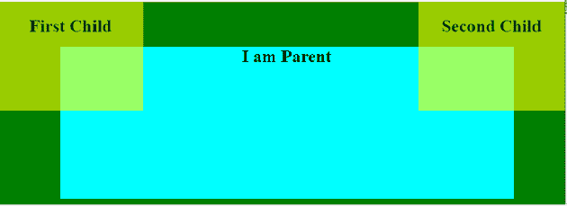
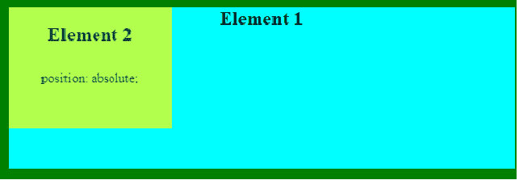
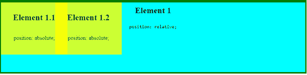
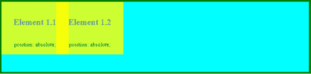
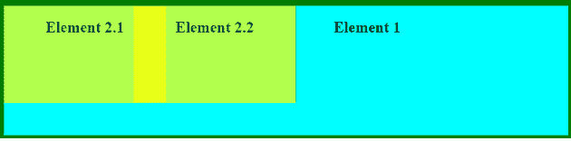

# CSS 中元素如何堆叠？

> 原文:[https://www.geeksforgeeks.org/how-to-stack-elements-in-css/](https://www.geeksforgeeks.org/how-to-stack-elements-in-css/)

为了创建有吸引力的和独特的网页，最终需要将一个元素添加到另一个元素之上，完全地或者只是它的一部分。有两种方法可以实现这一点。

*   使用 CSS 位置属性。
*   使用 CSS 网格。

**使用 CSS 位置属性:**属性`position: absolute;`用于将任意元素定位在绝对位置，该属性可用于将元素堆叠在彼此之上。使用这种方法，任何元素都可以放置在任何地方，而不管其他元素的位置如何。

**例 1:**

```html
<!DOCTYPE html>
<html>

<head>
    <style>
        body {
            font-family: "Times New Roman", sans-serif;
            background: green;
            color: black;
            text-align: center;
        }

        h2 {
            font-weight: bold;
            padding: 0 10px;
            margin-bottom: 10px;
        }

        .parentClass {
            background: cyan;
            width: 80vw;
            margin: 8vw 10vw;
            height: 210px;
        }

        .firstchild {
            top: 0;
            left: 0;
        }

        .secondchild {
            top: 0;
            right: 0;
        }

        .childClass {
            position: absolute;
            opacity: 0.6;
            height: 150px;
            background: yellow;
            width: 200px;

        }
    </style>
</head>

<body>

    <div class="parentClass">
        <h2>I am Parent</h2>
        <div class="childClass firstchild">
            <h2>First Child </h2>
        </div>

        <div class="childClass secondchild">
            <h2>Second Child </h2>
        </div>
    </div>
</body>

</html>
```

**输出:**



要创建一个可以在多个地方使用的自包含组件，您需要在另一个容器中有一个容器，这样父容器会根据子元素相对变化，您可以在父元素上使用`position: relative;`，在子元素上使用`position: absolute;`。

**例 2:**

```html
<!DOCTYPE html>
<html>

<head>
    <style>
        body {
            font-family: "Times New Roman", sans-serif;
            background: green;
            color: black;
            text-align: center;
        }

        h2 {
            font-weight: bold;
            padding: 0 20px;
            margin-bottom: 15px;
        }

        p {
            padding: 15px 10px;
        }

        .parentClass {
            position: relative;
            background: cyan;
            width: 80vw;
            margin: 8vw 10vw;
            height: 200px;
        }

        .childClass {
            top: 0;
            left: 0;
            opacity: 0.7;
            width: 200px;
            height: 150px;
            background: yellow;
            position: absolute;
        }
    </style>
</head>

<body>
    <div class="parentClass">
        <h2>Element 1</h2>
        <div class="childClass">
            <h2>Element 2</h2>
            <p>position: absolute;</p><br>
        </div>
    </div>
</body>

</html>
```

**输出:**



**示例 3:** 同样的实现也可以用于将两个元素堆叠在父元素的顶部。

```html
<!DOCTYPE html>
<html>

<head>
    <style>
        body {
            font-family: "Times New Roman", sans-serif;
            background: green;
            color: black;
            text-align: center;
        }

        h2 {
            font-weight: bold;
            padding: 10 20px;
            margin-bottom: 15px;
        }

        p {
            padding: 10px 10px;
        }

        .parentClass {
            position: relative;
            background: cyan;
            width: 80vw;
            margin: 8vw 10vw;
            height: 200px;
        }

        .childClass {
            opacity: 0.8;
            height: 150px;
            width: 190px;
            background: yellow;
            position: absolute;
            top: 0;
        }

        .child1 {
            left: 0;
        }

        .child2 {
            left: 155px;
        }
    </style>
</head>

<body>
    <div class="parentClass">
        <h2>Element 1</h2>
        <code>position: relative;</code>
        <div class="childClass child1">
            <h2>Element 1.1</h2>
            <p>position: absolute;</p><br>
        </div>
        <div class="childClass child2">
            <h2>Element 1.2</h2>
            <p>position: absolute;</p>
        </div>
    </div>
</body>

</html>
```

**输出:**



**使用 CSS 网格:**堆叠元素的另一种方式是使用 CSS 网格。网格可用于根据需要放置元素。使用下面的代码将一个元素简单地堆叠在另一个之上。

```html
.parentClass {
    grid-template-rows: 150px 1fr;
    grid-template-columns: 250px 1fr;
    display: grid;
}

.childClass {
    grid-area: 1 / 1 / 2 / 2;
}
```

**完整代码:**

```html
<!DOCTYPE html>
<html>

<head>
    <style>
        body {
            font-family: "Times New Roman", sans-serif;
            background: green;
            color: black;
            text-align: center;
        }

        h1 {
            color: black;
            font-weight: bold;
        }

        h2 {
            color: grey;
            font-weight: bold;
            padding: 25px 15px 20px;
            margin-bottom: 15px;
        }

        p {
            padding: 5px 10px;
        }

        .parentClass {
            position: relative;
            background: cyan;
            width: 80vw;
            margin: 8vw 10vw;
            height: 200px;
        }

        .childClass {
            opacity: 0.8;
            height: 150px;
            width: 190px;
            background: yellow;
            position: absolute;
            top: 0;
        }

        .child1 {
            left: 0;
        }

        .child2 {
            left: 155px;
        }

        .parentClass {
            display: grid;
            grid-template-rows: 150px 1fr;
            grid-template-columns: 250px 1fr;

        }

        .childClass {
            grid-area: 1 / 1 / 2 / 2;
        }
    </style>
</head>

<body>
    <div class="parentClass">
        <h1>Element 1</h1>

        <div class="childClass child1">
            <h2>Element 1.1</h2>
            <p>position: absolute;</p><br>
        </div>
        <div class="childClass child2">
            <h2>Element 1.2</h2>
            <p>position: absolute;</p>
        </div>
    </div>
</body>

</html>
```

**输出:**


如果需要一个子元素堆叠在另一个之上，并且两个子元素都堆叠在父元素之上。

```html
.parentClass {
    display: grid;
    grid-template-columns: 250px 1fr;
    grid-template-rows: 150px 1fr;
}

.childClass {
    grid-area: 1 / 1 / 2 / 2;
}

.child-2 {
    margin-left: 200px;
}
```

**完整代码示例:**

```html
<!DOCTYPE html>
<html>

<head>
    <style>
        body {
            font-family: "Times New Roman", sans-serif;
            background: green;
            color: black;
            text-align: center;
        }

        h2 {
            font-weight: bold;
            padding: 10 10px;
            margin-bottom: 5px;
        }

        .parentClass {
            display: grid;
            grid-template-columns: 250px 1fr;
            grid-template-rows: 150px 1fr;
            background: cyan;
            width: 80vw;
            margin: 8vw 10vw;
            height: 200px;
        }

        .childClass {
            grid-area: 1/1/2/2;
            opacity: 0.7;
            height: 150px;
            width: 250px;
            background: yellow;
        }

        .child2 {
            margin-left: 200px;
        }
    </style>
</head>

<body>
    <div class="parentClass">
        <h2>Element 1<br>
        </h2>
        <div class="childClass">
            <h2>Element 2.1</h2>
        </div>

        <div class="childClass child2">
            <h2>Element 2.2</h2>
        </div>
    </div>
</body>

</html>
```

**输出:**
