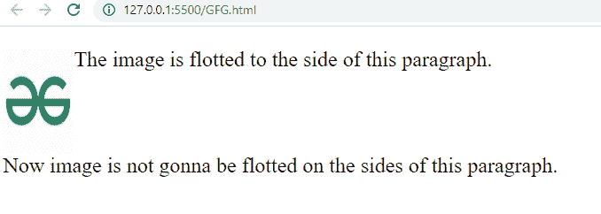

# 如何在 CSS 中阻止任何元素浮在段落元素的侧面？

> 原文:[https://www . geeksforgeeks . org/如何阻止任何元素在 css 中的段落元素旁浮动/](https://www.geeksforgeeks.org/how-to-stop-any-element-to-be-floated-on-the-sides-of-paragraph-element-in-css/)

在本文中，我们将学习如何在 CSS 中阻止元素浮动在段落元素的侧面。clear 属性用于控制元素在段落两侧浮动。

**方法:****[**清除属性**](https://www.geeksforgeeks.org/css-clear-property/) 用于控制元素浮动在段落两侧。它接受我们想要阻止元素浮动的方向，比如:左、右、上、下，以及两者。因此，将 clear 值固定为两者，以防止元素浮在段落的两侧。**

****语法:****

```html
clear: none|left|right|both|initial;
```

****示例:****

## **超文本标记语言**

```html
<!DOCTYPE html>
<html>
    <head>
        <style>
            img {
            float: left;
            }
            p{
                font-size: 30px;    
            }
            p.gfg {
                clear: top;
            }
        </style>
    </head>
    <body>

        
        <p>The image is flotted to the side of this paragraph.</p>
        <p class="gfg">
          Now image is not gonna be flotted on the 
          sides of this paragraph.
        </p>
    </body>
</html>
```

****输出:****

*   **在应用清除属性之前:**

    ****

*   **应用清除属性后:**

    ****