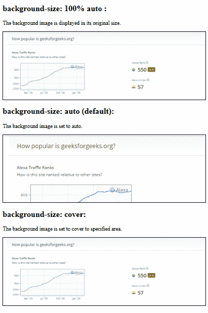
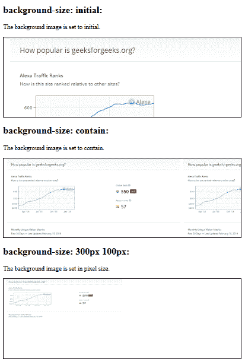

# 如何使用 CSS 拉伸和缩放背景图像？

> 原文:[https://www . geeksforgeeks . org/如何使用 css 拉伸和缩放背景图像/](https://www.geeksforgeeks.org/how-to-stretch-and-scale-background-image-using-css/)

**背景尺寸属性**用于拉伸和缩放背景图像。此属性设置背景图像的大小。这里我们将看到背景尺寸和背景比例属性的所有可能的例子。

**语法:**

```css
background-size: auto|length|cover|contain|initial|inherit;
```

**覆盖:**该属性值用于在 x 和 y 方向拉伸背景图像并覆盖整个区域。
**长度:**该属性值用于缩放背景图像。它会改变背景图像的大小。长度值可以是 px、em %等形式。

**示例 1:** 本示例在 x 和 y 方向拉伸背景图像。

```css
<!DOCTYPE html>
<html>
   <head>
      <style>

         /*background-size: 100% auto with no repeat */
         #example1 {
             width:600px; /* screen width */
             height:200px; /* screen height */
             border: 2px solid black;
             background: url(
https://media.geeksforgeeks.org/wp-content/uploads/Screenshot-45-8.png);
             background-repeat: no-repeat;
             background-size: 100% auto;
         }
         /*background-size:auto with no repeat*/
         #example2 {
             width:600px; /* screen width */
             height:200px; /* screen height */
             border: 2px solid black;
             background: url(
https://media.geeksforgeeks.org/wp-content/uploads/Screenshot-45-8.png);
             background-repeat: no-repeat;
             background-size: auto;
         }
         /* background-size: cover with no repeat */
         #example3 {
             border: 2px solid black;
             width:600px; /* screen width */
             height:200px; /* screen height */
             background: url(
https://media.geeksforgeeks.org/wp-content/uploads/Screenshot-45-8.png);
             background-repeat: no-repeat;
             background-size: cover;
         }
      </style>
   </head>

   <body>
      <h2>background-size: 100% auto :</h2>
      <p>
          The background image is displayed
          in its original size.
      </p>
      <div id="example1"></div>

      <h2>background-size: auto (default):</h2>
      <p>The background image is set to auto.</p>
      <div id="example2"></div>

      <h2>background-size: cover:</h2>
      <p>
          The background image is set to cover
          to specified area.
      </p>
      <div id="example3"></div>

   </body>
</html>        
```

**输出:**


**示例 2:** 本示例缩放背景图像。

```css
<!DOCTYPE html>
<html>
   <head>
      <style>

         /*background-size: initial with no repeat */
         #example1 {
             width:600px;/* screen width */
             height:200px;/* screen height */
             border: 2px solid black;
             background: url(
https://media.geeksforgeeks.org/wp-content/uploads/Screenshot-45-8.png);
             background-repeat: no-repeat;
             background-size: initial;
         }

         /*background-size: contain with repeat */
         #example2 {
             border: 2px solid black;
             width:600px;/* screen width */
             height:200px;/* screen height */
             background: url(
https://media.geeksforgeeks.org/wp-content/uploads/Screenshot-45-8.png);
             background-size: contain;
         }

         /*background-size: 300px 100px with no repeat */
         #example3 {
             border: 2px solid black;
             width:600px;/* screen width */
             height:200px;/* screen height */
             background: url(
https://media.geeksforgeeks.org/wp-content/uploads/Screenshot-45-8.png);
             background-repeat: no-repeat;
             background-size: 300px 100px;
         }
      </style>
   </head>

   <body>
      <h2>background-size: initial:</h2>
      <p>The background image is set to initial.</p>
      <div id="example1"></div>

      <h2>background-size: contain:</h2>
      <p>The background image is set to contain.</p>
      <div id="example2"></div>

      <h2>background-size: 300px 100px:</h2>
      <p>The background image is set in pixel size.</p>
      <div id="example3"></div>
   </body>
</html>
```

**输出:**
