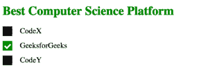
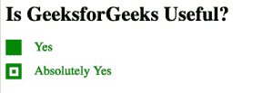

# 如何使用 CSS 设置复选框的样式？

> 原文:[https://www . geesforgeks . org/how-style-a-checkbox-use-CSS/](https://www.geeksforgeeks.org/how-to-style-a-checkbox-using-css/)

复选框是一个 HTML 元素，用于接受用户的输入。虽然设置样式有点复杂，但是使用伪元素，如:之前、之后、悬停和:选中，可以设置复选框的样式。为了设置复选框的样式，用户首先需要隐藏默认复选框，这可以通过将可见性属性的值设置为隐藏来完成。

**示例 1:** 考虑使用 CSS 设置 HTML 复选框样式的示例。首先创建三个复选框，然后默认复选框为隐藏，并使用高度和宽度属性创建新复选框。将高度和宽度属性设置为 25px，初始背景颜色设置为黑色。复选标记也可以使用 webkit 手动设置样式。“:选中”用于在复选框被选中后设置其样式。当用户单击复选框时，背景颜色设置为绿色。
基本上，你应该通过思考你希望你的复选框有不同风格的场景来接近它，比如当它是正常的、活动的、悬停的或选中的等等。然后为每个场景指定不同的样式，就像在普通 CSS 中使用的一样。此外，还可以更改复选标记。

```
<!DOCTYPE html>
<html>

<head>
    <style>
        .main {
            display: block;
            position: relative;
            padding-left: 45px;
            margin-bottom: 15px;
            cursor: pointer;
            font-size: 20px;
        }

        /* Hide the default checkbox */
        input[type=checkbox] {
            visibility: hidden;
        }

        /* Creating a custom checkbox
        based on demand */
        .geekmark {
            position: absolute;
            top: 0;
            left: 0;
            height: 25px;
            width: 25px;
            background-color: black;
        }

        /* Specify the background color to be
        shown when hovering over checkbox */
        .main:hover input ~ .geekmark {
            background-color: yellow;
        }

        /* Specify the background color to be
        shown when checkbox is active */
        .main input:active ~ .geekmark {
            background-color: red;
        }

        /* Specify the background color to be
        shown when checkbox is checked */
        .main input:checked ~ .geekmark {
            background-color: green;
        }

        /* Checkmark to be shown in checkbox */
        /* It is not be shown when not checked */
        .geekmark:after {
            content: "";
            position: absolute;
            display: none;
        }

        /* Display checkmark when checked */
        .main input:checked ~ .geekmark:after {
            display: block;
        }

        /* Styling the checkmark using webkit */
        /* Rotated the rectangle by 45 degree and 
        showing only two border to make it look
        like a tickmark */
        .main .geekmark:after {
            left: 8px;
            bottom: 5px;
            width: 6px;
            height: 12px;
            border: solid white;
            border-width: 0 4px 4px 0;
            -webkit-transform: rotate(45deg);
            -ms-transform: rotate(45deg);
            transform: rotate(45deg);
        }
    </style>
</head>

<body>

    <h1 style="color:green;">
        Best Computer Science Platform
    </h1>

    <label class="main">CodeX
        <input type="checkbox">
        <span class="geekmark"></span>
    </label>

    <label class="main">GeeksforGeeks
        <input type="checkbox" checked="checked">
        <span class="geekmark"></span>
    </label>

    <label class="main">CodeY
        <input type="checkbox">
        <span class="geekmark"></span>
    </label>
</body>
</html>                    
```

**输出:**


**注:**

*   “~”是选择前一个选择器前面的所有元素的兄弟组合符。
*   “:悬停”用于在用户悬停在复选框上时设置其样式。请注意，当鼠标指针移到复选框上时，它的颜色会变为黄色。
*   “:active”用于在复选框处于活动状态时设置其样式。请注意，当单击复选框时，它将首先注意到红色，然后是绿色。

**例 2:** 考虑另一个带有校验位修改设计的例子。

```
<!DOCTYPE html>
<html>

<head>
    <title>
        Style a checkbox using CSS
    </title>

    <style>
        .script {
            display: block;
            position: relative;
            padding-left: 45px;
            margin-bottom: 15px;
            cursor: pointer;
            font-size: 20px;
        }

        /* Hide the default checkbox */
        input[type=checkbox] {
            visibility: hidden;
        }

        /* creating a custom checkbox based
            on demand */
        .geekmark {
            position: absolute;
            top: 0;
            left: 0;
            height: 25px;
            width: 25px;
            background-color: green;
        }

        /* specify the background color to be
        shown when hovering over checkbox */
        .script:hover input ~ .geekmark {
            background-color: yellow;
        }

        /* specify the background color to be
        shown when checkbox is active */
        .script input:active ~ .geekmark {
            background-color: red;
        }

        /* specify the background color to be
        shown when checkbox is checked */
        .script input:checked ~ .geekmark {
            background-color: green;
        }

        /* checkmark to be shown in checkbox */
        /* It is not be shown when not checked */
        .geekmark:after {
            content: "";
            position: absolute;
            display: none;
        }

        /* display checkmark when checked */
        .script input:checked ~ .geekmark:after {
            display: block;
        }

        /* styling the checkmark using webkit */
        /* creating a square to be the sign of
            checkmark */
        .script .geekmark:after {
            left: 6px;
            bottom: 5px;
            width: 6px;
            height: 6px;
            border: solid white;
            border-width: 4px 4px 4px 4px;
        }
    </style>
</head>

<body>
    <h1>Is GeeksforGeeks Useful?</h1>

    <label class="script" style = "color:green;">
        Yes
        <input type="checkbox">
        <span class="geekmark"></span>
    </label>

    <label class="script" style = "color:green;">
        Absolutely Yes
        <input type="checkbox" checked="checked">
        <span class="geekmark"></span>
    </label>
</body>

</html>                    
```

**输出:**


CSS 是网页的基础，通过设计网站和网络应用程序用于网页开发。你可以通过以下 [CSS 教程](https://www.geeksforgeeks.org/css-tutorials/)和 [CSS 示例](https://www.geeksforgeeks.org/css-examples/)从头开始学习 CSS。