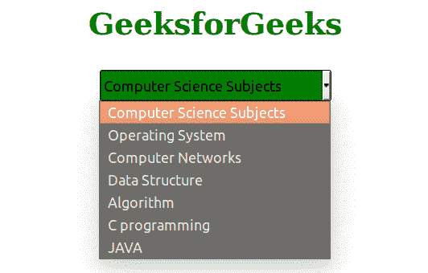

# 如何使用 CSS 设计下拉菜单的样式？

> 原文:[https://www . geeksforgeeks . org/how-style-a-down-using-CSS/](https://www.geeksforgeeks.org/how-to-style-a-dropdown-using-css/)

在本文中，我们将知道如何使用 CSS 来设计下拉列表的样式，并将通过示例来理解它的实现。设计 [<使用 CSS 选择>](https://www.geeksforgeeks.org/html-select-tag/) 下拉菜单的方法有很多。下拉菜单主要用于从元素列表中选择一个元素。每个菜单选项可以由 [<选项>](https://www.geeksforgeeks.org/html-option-tag/) 元素定义，该元素可以嵌套在<选择>元素中。每个<选项>元素将被指定为*值*属性，该属性包含选择特定选项时将提交给服务器的数据值。

**示例 1:** 本示例包含显示下拉框外观的下拉 CSS 属性。它包含设置下拉背景色、文本颜色、字体大小、光标指针等的 CSS 属性。

## 超文本标记语言

```html
<!DOCTYPE html>
<html>

<head>
    <style>
    select {
        appearance: none;
        outline: 0;
        background: green;
        background-image: none;
        width: 100%;
        height: 100%;
        color: black;
        cursor: pointer;
        border: 1px solid black;
        border-radius: 3px;
    }

    .select {
        position: relative;
        display: block;
        width: 15em;
        height: 2em;
        line-height: 3;
        overflow: hidden;
        border-radius: .25em;
        padding-bottom: 10px;
    }

    h1 {
        color: green;
    }
    </style>
</head>

<body>
    <center>
        <h1>GeeksforGeeks</h1>
        <div class="select">
            <select name="slct" id="slct">
                <option>Computer Science Subjects</option>
                <option value="1">Operating System</option>
                <option value="2">Computer Networks</option>
                <option value="3">Data Structure</option>
                <option value="4">Algorithm</option>
                <option value="5">C programming</option>
                <option value="6">JAVA</option>
            </select>
        </div>
    </center>
</body>

</html>
```

**输出:**



**示例 2:** 该示例包含一些 CSS 属性来显示下拉框的外观，其中-webkit-、-moz-和-ms-用于浏览器支持。

## 超文本标记语言

```html
<!DOCTYPE html>
<html>

<head>
    <style>
    h1 {
        color: green;
    }

    select {
        -webkit-appearance: none;
        -moz-appearance: none;
        -ms-appearance: none;
        appearance: none;
        outline: 0;
        background: green;
        background-image: none;
        border: 1px solid black;
    }

    .select {
        position: relative;
        display: block;
        width: 20em;
        height: 3em;
        line-height: 3;
        background: #2C3E50;
        overflow: hidden;
        border-radius: .25em;
    }

    select {
        width: 100%;
        height: 100%;
        margin: 0;
        padding: 0 0 0 .5em;
        color: #fff;
        cursor: pointer;
    }

    select::-ms-expand {
        display: none;
    }

    .select::after {
        content: '\25BC';
        position: absolute;
        top: 0;
        right: 0;
        bottom: 0;
        padding: 0 1em;
        background: #34495E;
        pointer-events: none;
    }

    .select:hover::after {
        color: #F39C12;
    }

    <!-- For different browsers --> .select::after {
        -webkit-transition: .25s all ease;
        -o-transition: .25s all ease;
        transition: .25s all ease;
    }
    </style>
</head>

<body>
    <center>
        <h1>GeeksforGeeks</h1>
        <div class="select">
            <select name="slct" id="slct">
                <option>Computer Science Subjects</option>
                <option value="1">Operating System</option>
                <option value="2">Computer Networks</option>
                <option value="3">Data Structure</option>
                <option value="4">Algorithm</option>
                <option value="5">C programming</option>
                <option value="6">JAVA</option>
            </select>
        </div>
    </center>
</body>

</html>
```

**输出:**


CSS 是网页的基础，通过设计网站和网络应用程序用于网页开发。你可以通过以下 [CSS 教程](https://www.geeksforgeeks.org/css-tutorials/)和 [CSS 示例](https://www.geeksforgeeks.org/css-examples/)从头开始学习 CSS。