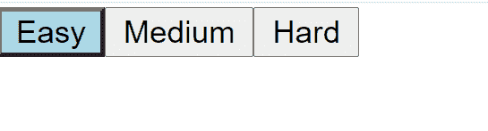

# 如何在用 map()渲染的按钮之间切换 CSS 类？

> 原文:[https://www . geesforgeks . org/how-switch-CSS-类-按钮间-用地图渲染/](https://www.geeksforgeeks.org/how-to-switch-css-class-between-buttons-rendered-with-map/)

我们可以在按钮被点击时改变其颜色，也可以使用 map()函数将之前选择的按钮的颜色改变回其初始的原始颜色。

**创建反应应用程序:**

**步骤 1:** 使用以下命令创建一个反应应用程序:

```css
npx create-react-app foldername
```

**步骤 2:** 创建项目文件夹(即文件夹名)后，使用以下命令移动到该文件夹:

```css
cd foldername
```

**项目结构:**如下图。


项目结构

**示例:**在下面的示例中，我们已经在状态中存储了当前所选按钮的名称(或某些 ID)。

**文件名:App.js**

## 超文本标记语言

```css
import React, { useState } from "react";

const App = () => {
  const menuItems = ["Easy", "Medium", "Hard"];
  const [activeButton, setActiveButton] = useState("");

  return (
    <div>
      {menuItems.map((level, idx) => {
        return (
          <button
            key={level}
            onClick={() => {
              setActiveButton(level);
            }}
            style={{
              backgroundColor: activeButton === level ? "lightblue" : ""
            }}
          >
            {level}
          </button>
        );
      })}
    </div>
  );
}

export default App;
```

**运行应用程序的步骤:**从项目的根目录使用以下命令运行应用程序:

```css
npm start
```

**输出:**



颜色在点击按钮之间切换

**注意:**我们要注意的一点是给按钮取不同的名字。此外，一个更令人鼓舞的方法是为按钮使用标识，如下所示:

```css
const menuItems = [{id:1, name:"Easy"}, 
                        {id:2, name:"Medium"}, 
                        {id:3, name:"Hard"}]
```