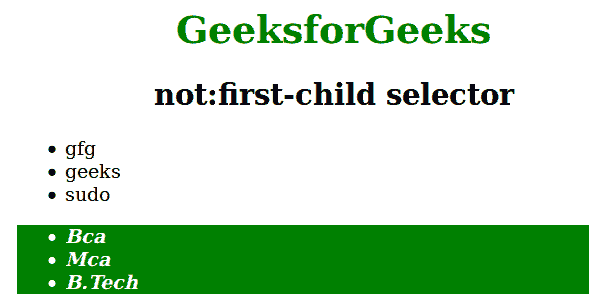

# 如何在 CSS 中使用一个 not:第一子选择器？

> 原文:[https://www . geesforgeks . org/如何使用非第一个孩子的 css 选择器/](https://www.geeksforgeeks.org/how-to-use-a-notfirst-child-selector-in-css/)

该选择器用于选择不是其父元素的第一个子元素的每个元素。它以参数的形式表示:not(第一个子)元素。

**语法:**

```css
:not( element ) {
  // CSS property
} 

```

**示例:**

```css
<!DOCTYPE html>
<html>
    <head>
        <title>not first child selector</title>
        <style>
            h1 {
            color:green;
            }
            div ul:not(:first-child) {
                background-color: green;
                color:white;
                font-style:italic;
                font-weight:bold;
                width:60%;
                margin-left:100px;
            }
            h1, h2 {
                text-align:center;
            }
        </style>
    </head>
    <body>
        <h1>GeeksforGeeks</h1>
        <h2>not:first-child selector </h2>
        <div>
            <ul style="margin-left:100px">
                <li>gfg</li>
                <li>geeks</li>
                <li>sudo</li>
            </ul>
            <ul>
                <li>Bca</li>
                <li>Mca</li>
                <li>B.Tech</li>
            </ul>
        </div>
    </body>
</html>                    
```

**输出**

**解释:**上面的例子说明了一个< div >是一个容器标签。它包含< ul >标签，因此它选择< div >标签的所有子元素，除了它的第一个子元素。

**支持的浏览器:**支持的浏览器有:not:(第一子)选择器如下:

*   苹果 Safari 3.1
*   谷歌 Chrome 4.0
*   Firefox 3.0
*   歌剧 9.6
*   Internet Explorer 7.0