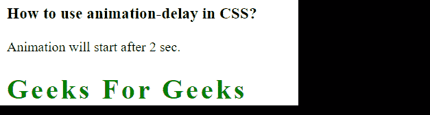

# 如何在 CSS 中使用动画-延迟？

> 原文:[https://www . geeksforgeeks . org/如何使用-动画-延迟-in-css/](https://www.geeksforgeeks.org/how-to-use-animation-delay-in-css/)

在本文中，我们将看到如何在 CSS 中使用动画延迟属性。动画延迟属性用于设置网页上的动画。

*   动画延迟属性告诉我们动画开始的延迟。
*   动画延迟值以毫秒(ms)或秒(s)为单位定义。
*   它的默认值是 0 秒。
*   属性在使网页具有吸引力方面非常有用

**CSS 语法:**

```css
animation-delay: time |initial |inherit;
```

**属性值:**

*   **时间:**该值可选。它用于定义动画开始前等待的秒数或毫秒数，即动画延迟的时间。默认值为 0。允许负值。如果使用负值，动画将开始播放，就像已经播放了 N 秒/毫秒一样。
*   **初始值:**该值用于将属性设置为默认值。
*   **inherit:** 该值用于从其父元素继承属性。

下面的例子说明了动画延迟属性在 CSS 中的使用。

**示例 1:** 在本例中，我们使用动画属性来添加动画效果，还使用动画-延迟属性来添加动画中的时间延迟。

## 超文本标记语言

```css
<!DOCTYPE html>
<html>

<head>
    <style>
        h1 {
            color: green;
            position: relative;
            animation: lit 2s;
            animation-delay: 2s;
        }

        @keyframes lit {
            from {
                left: 0px;
            }

            to {
                left: 200px;
            }
        }
    </style>
</head>

<body>
    <h3>
        How to use animation-delay in CSS?
    </h3>

    <p>Animation will start after 2 sec.</p>

    <h1>GeeksforGeeks</h1>
</body>

</html>
```

**输出:**


**示例 2:** 在本例中，我们使用动画名称属性来添加动画效果，还使用动画延迟属性来添加动画中的时间延迟。我们还使用了动画迭代计数属性来添加动画迭代。

## 超文本标记语言

```css
<!DOCTYPE html>
<html>

<head>
    <style>
        .separation {
            color: white;
            animation-name: separation;
            animation-duration: 2s;
            animation-timing-function: 
                cubic-bezier(0.25, 0.1, 0.25, 3.0);
            animation-delay: 2s;
            animation-iteration-count: 1;
            animation-direction: normal;
            animation-fill-mode: forwards;
        }

        @keyframes separation {
            0% {
                letter-spacing: 1.2em;
                color: orange;
            }

            100% {
                letter-spacing: 0.1em;
                color: green;
            }
        }
    </style>
</head>

<body>
    <h3>
        How to use animation-delay in CSS?
    </h3>

    <p>Animation will start after 2 sec.</p>

    <h1 class="separation">Geeks For Geeks</h1>
</body>

</html>
```

**输出:**

