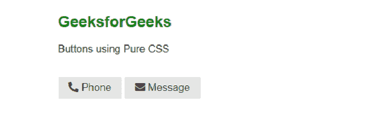
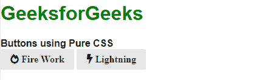

# 如何使用 Pure CSS 使用带图标的按钮？

> 原文:[https://www . geeksforgeeks . org/如何使用带图标的按钮-使用纯 css/](https://www.geeksforgeeks.org/how-to-use-buttons-with-icons-using-pure-css/)

使用纯 CSS 将图标字体与纯按钮合并是一项简单的任务。由于 Pure CSS 没有自带图标包，我们使用的图标字体来自 [Font Awesome](https://fontawesome.com/) 。

在创建带有图标的按钮之前，我们首先必须将 [pure.css](https://purecss.io/start/) 文件直接从 CDN 包含到我们的 HTML 文件中。然后链接字体真棒 CSS 文件到你的页面。

**示例 1:** 下面的代码演示了使用各种纯 CSS 类的纯按钮。为了更好地理解，请参考以下代码和输出图像中的注释。

## 超文本标记语言

```html
<!DOCTYPE html>
<html>
<head>
    <!--Import Font Awesome icon pack-->
    <link
      rel="stylesheet"
      href=
"https://cdnjs.cloudflare.com/ajax/libs/font-awesome/5.15.2/css/all.min.css"
      integrity=
"sha512-HK5fgLBL+xu6dm/Ii3z4xhlSUyZgTT9tuc/hSrtw6uzJOvgRr2a9jyxxT1ely+B+xFAmJKVSTbpM/CuL7qxO8w=="
      crossorigin="anonymous"/>

    <!--Import Pure Css files-->
    <link
      rel="stylesheet"
      href=
"https://unpkg.com/purecss@1.0.0/build/pure-min.css"
      integrity=
"sha384-nn4HPE8lTHyVtfCBi5yW9d20FjT8BJwUXyWZT9InLYax14RDjBj46LmSztkmNP9w"
      crossorigin="anonymous"/>

</head>

<body>
     <h2 style="color:green">GeeksforGeeks</h2>

<p>Buttons using Pure CSS</p>

     <br/>
    <!--Use <i> element within class "pure-button"-->
        <button class="pure-button" href="#">
            <i class="fas fa-phone-alt"></i>
            Phone
        </button>

        <button class="pure-button" href="#">
            <i class="fas fa-envelope"></i>
            Message
        </button>

</body>

</html>
```

**输出:**



**示例 2:** 以下示例演示了使用纯 CSS 类的其他按钮。开发人员可以开发自己的自定义按钮，如下面所示的成功按钮。

## 超文本标记语言

```html
<!DOCTYPE html>
<html>
  <head>
    <!--Import Font Awesome icon pack-->
    <link
      rel="stylesheet"
      href=
"https://cdnjs.cloudflare.com/ajax/libs/font-awesome/5.15.2/css/all.min.css"
      integrity=
"sha512-HK5fgLBL+xu6dm/Ii3z4xhlSUyZgTT9tuc/hSrtw6uzJOvgRr2a9jyxxT1ely+B+xFAmJKVSTbpM/CuL7qxO8w=="
      crossorigin="anonymous"/>

    <!--Import Pure Css files-->
    <link
      rel="stylesheet"
      href=
"https://unpkg.com/purecss@1.0.0/build/pure-min.css"
      integrity=
"sha384-nn4HPE8lTHyVtfCBi5yW9d20FjT8BJwUXyWZT9InLYax14RDjBj46LmSztkmNP9w"
      crossorigin="anonymous"/>

    <style>
      .button-success {
        color: white;
        border-radius: 3px;
        background: green;
      }
    </style>
  </head>

  <body>
    <h1 style="color: green">GeeksforGeeks</h1>
    <strong>Buttons using Pure CSS</strong>

    <br />
    <button class="pure-button">
      <i class="fas fa-fire-alt"> Fire Work</i>
    </button>

    <button class="pure-button">
      <i class="fa fa-bolt"> Lightning</i>
    </button>
  </body>
</html>
```

**输出:**

