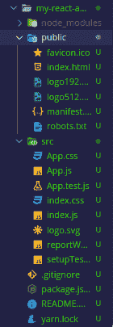
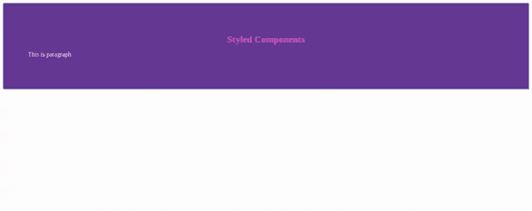
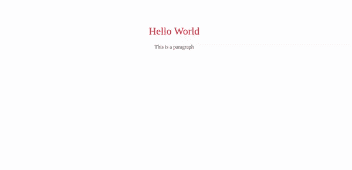
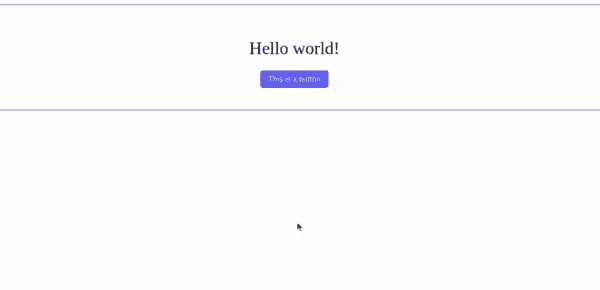
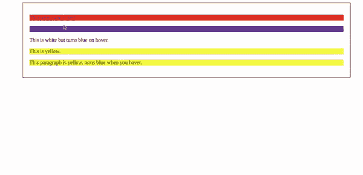

# 如何使用不同维度的 CSS(CSS-in-JS)？

> 原文:[https://www . geesforgeks . org/how-用法-不同维度中的 CSS-CSS-in-js/](https://www.geeksforgeeks.org/how-to-use-css-in-different-dimension-css-in-js/)

今天我们将看到关于 JavaScript 中的 CSS。CSS 很棒，也很容易上手，但是前端应用程序一直在以巨大而复杂的速度扩展，这使得当前的 CSS 不适合这项工作。JS-in-JS 是一个真正的交易，在很多方面，当涉及到在网络上构建和设计应用程序时，它是最好的。

**什么是 CSS-in-JS:** 顾名思义，CSS-in-Javascript。它仍然是 CSS，但是它利用了 JavaScript 的功能。它使用 JavaScript 作为一种语言，以声明性和可维护的方式描述样式。

**JS 中 CSS 的好处:**

1.  它抛出错误来帮助您避免错误，包括语法、类型和未定义的错误。
2.  它使死代码更容易管理。
3.  它帮助您利用 JavaScript 生态系统中的任何东西。
4.  您不必维护多个 CSS 文件。
5.  许多 CSS-in-JS 库提供了像关键 CSS 一样的性能改进，不需要额外的设置。

**何时使用 CSS-in-JS:** 一个刚入门的人，如果只想创建没有动态前端的网站，可能会发现标准的 CSS 是造型的最佳选择。但是对于从事组件化 javascript 项目的开发人员来说，JS-in-JS 是您的最佳选择。

**在 JS 中实现 CSS:**没有 JS 中的 CSS 库，我们无法使用 JS 中的 CSS。有很多 CSS-in-JS 库，让我们通过例子看看如何在这些库的帮助下在 JS 中使用 CSS。

**创建反应应用程序:**

**步骤 1:** 使用以下命令创建一个反应应用程序:

```html
npx create-react-app 
```

**步骤 2:** 现在，通过在命令提示符终端中编写以下命令，导航到“表单”文件夹。

```html
cd foldername
```

**项目结构:**如下图。



**步骤 3:** 键入以下命令，在浏览器 localhost: 3000 上运行您的项目

```html
npm start
```

**1。样式组件:**它是 Github 上最流行的 JS 中 CSS 库之一。它在 GitHub 上有 23K+颗星。使用样式化组件，可以创建一个普通的带有附加样式的反应组件。style-component 有很棒的特性，比如没有类名 bug，不费力的维护。下面是如何使用样式化组件的步骤:

**步骤 1:** 在您的终端中使用以下命令安装所需的库:

```html
// with npm
npm install styled-components

or
// with yarn
yarn add styled-components
```

**步骤 2:** 现在安装完成。在 App.js 文件中写下以下代码。下面是一个如何用 CSS 样式化的例子——在 JS 库中**样式化的组件**。在这个文件中，我们将首先通过导入样式化组件来快速设置 javascript 的样式，然后开始设置样式。

## App.js

```html
import React from 'react';
import styled from 'styled-components;

const Title = styled.h1`
  font-size: 1.5em;
  text-align: center;
  color: hotpink;
`;

// The Title component will render
// an <h1> tag with some styles

const Wrapper = styled.div`
  padding: 4em;
  background: rebeccapurple;
`;
// The Wrapper component will render
// a <div> tag with some styles

const Paragraph =styled.p`
color: white;

// When styling classes you simply use
// an ampersand and you style your class
// just like you did with traditional CSS

& .text{
text-align: left;

}
&:hover{
  color:pink;
}`

// The paragraph component will render a 
// <p> tag with some styles

const App = () =>{
return(
  <Wrapper>
    <Title>
      Styled Components
    </Title>
    <Paragraph className='text'>
        This is paragraph
    </Paragraph>
  </Wrapper>
);
}

// Use Title and Wrapper like any other
// React component – except they're styled!
```

**第三步:**在终端运行下面的代码

```html
npm start
or
yarn start
```

**输出:**



**2。JSS:** 是 GitHub 上又一个 6k 星以上的库。JSS 是一个 CSS 创作工具，它允许你使用 JavaScript 以一种声明性的、无冲突的、可重用的方式来描述样式。它由多个包组成:核心、插件、框架集成和其他。如何与 JSS 合作的步骤如下:

**步骤 1:** 在您的终端中使用以下命令安装所需的库:

```html
// with  npm
npm install --save react-jss

or
// with yarn
yarn add react-jss
```

**步骤 2:** 现在安装完成，在 App.js 文件中写下以下代码。这里有一个如何用 CSS 样式的例子——在 JS 库中 **JSS** 。在这个文件中，我们将首先通过导入 JSS 来快速设置 javascript 的样式，然后开始设置样式。

## App.js

```html
import React from 'react';
import {createUseStyles} from 'react-jss'

const useStyles = createUseStyles({
 wrapper: {
  textAlign: 'center',
   width: '100%',
   padding: '50px',
   color: '#444',
 },

 title: {
   color: '#fd1a26',
   fontWeight: 400,
 },
});

const App = () => {
const classes = useStyles()
return(
 <div className={classes.wrapper}>
    <h1 className={classes.title}>Hello World</h1>
    <p className={classes.p}>This is a paragraph</p>

  </div>
)
}

export default App;
```

**注意:**在 JSS 造型的时候你用逗号来分隔不同元素的风格和造型。

**第三步:**在终端运行下面的代码

```html
npm start
or
yarn start
```

**输出:**



**3。情感:**这是一个关注应用程序性能的 CSS-in-JS 库。它在 GitHub 上有 7.7K 多颗星。它提供了强大且可预测的样式组合，此外还提供了强大的开发者体验，如源地图、标签和测试实用程序。如何处理情绪的步骤如下:

**步骤 1:** 在您的终端中使用以下命令安装所需的库:

```html
// with npm
npm install @emotion/styled @emotion/react

or

// with yarn
yarn add @emotion/styled @emotion/react
```

**步骤 2:** 现在安装完成，在 App.js 文件中写下以下代码。下面是一个如何使用 CSS-in-JS 库**情感**进行风格化的例子。在这个文件中，我们将通过使用**情感**来快速设置我们的 javascript 样式，首先通过导入它，然后您开始设置样式。

## App.js

```html
/** @jsx jsx */
import React from 'react';
import { jsx, css } from '@emotion/react';
import styled from '@emotion/styled';

const Wrapper = css`
 display: flex;
 flex-direction: column;
 align-items: center;
 justify-content: center;
 width: 100%;
 padding: 40px;
 color: #444;
 border: 1px solid #4800f4;
`;

const Title = styled.h1`
 color: #0d1a26;
 font-weight: 400;
`;

const Button = styled('button')`
 padding: 8px 15px;
 border: none;
 border-radius: 5px;
 background-color: #4800f4;
 color: #fff;
 font-size: 14px;
 cursor: pointer;

 &:hover {
 transition: .5s;  
 padding: 10px 20px;
 }
`;

const App = () => {
return(
 <div css={Wrapper}>
 <Title>Hello world!</Title>
 <Button>This is a button</Button>
</div>
)
};
```

**第三步:**在终端运行下面的代码

```html
npm start
or
yarn start
```

**情感具有与风格化成分相似的句法。**

**注意:**如果不在文件行顶部包含此注释，情感将不会运行:

```html
/** @jsx jsx */
```

**输出:**



**4。阿芙罗狄蒂:**它是另一个在 Github 上拥有超过 5.2k 星的 CSS-in-JS。Aphrodite 是一个与框架无关的 CSS-in-JS，支持服务器端呈现、浏览器前缀和最小 CSS 生成。不管有没有反应，这个库都很好用。下面是如何使用阿芙罗狄蒂的步骤

**步骤 1:** 在您的终端中使用以下命令安装所需的库:

```html
// with npm
npm install aphrodite
```

**步骤 2:** 现在安装完成，在 App.js 文件中写下以下代码。下面是一个如何使用 Js-in-CSS 库**阿芙罗狄蒂**进行风格化的例子。在这个文件中，我们将通过使用**阿芙罗狄蒂**来快速设计我们的 javascript，首先通过导入它，然后开始设计。

## App.js

```html
import React, { Component } from 'react';
import { StyleSheet, css } from 'aphrodite';

const styles = StyleSheet.create({
  container: {
  width: '70%',
  padding: '20px',
  border: '1px solid #000',
},
red: {
  backgroundColor: 'red'
},

blue: {
  backgroundColor: 'yellow'
},

hover: {
  background:'rebeccapurple',
    ':hover': {
      backgroundColor: 'hotpink'
    }
  },

  small: {
    ':hover': {
      backgroundColor: 'royalBlue',
    },
  }
});

class App extends Component {
  render() {
    return (
      <div>
        <p className={css(styles.red)}>
          This paragraph is purple.
        </p>

        <p className={css(styles.hover)}>
          This paragraph is indigo and 
          turns purple on hover.
        </p>

        <p className={css(styles.small)}>
          This turns blue when the browser 
          is less than 600px width.
        </p>

        <p className={css(styles.red, styles.blue)}>
          This is yellow.
        </p>

        <p className={css(styles.blue, styles.small)}>
          This paragraph is white, turns blue 
          when the browser is less than 600px width.
        </p>
      </div>
    }
  }
}
```

**第三步:**在终端运行下面的代码

```html
npm start
or
yarn start
```

**输出:**

