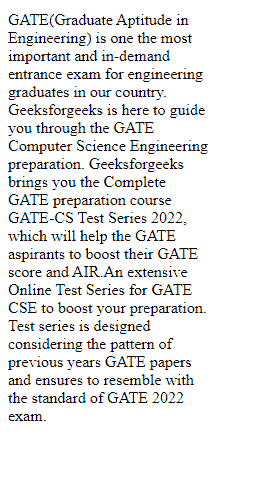
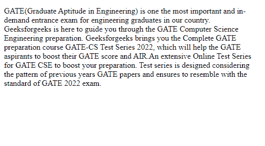

# 如何在 CSS 中使用换行符？

> 原文:[https://www.geeksforgeeks.org/how-to-use-line-break-in-css/](https://www.geeksforgeeks.org/how-to-use-line-break-in-css/)

在本文中，我们将学习如何使用 CSS 的属性来打断任何语句的一行。你必须知道 HTML 中用来换行的
标记。但是在本文中，我们将只使用 CSS 来执行这个任务。

我们在 **CSS** 中使用 **字**–**断** 属性，也就是使用来指定字在到达行末尾时应该如何断或拆分。 **字**–**包** 属性是用来将拆分/ 断长字和包它们到下一个行中。 **溢出**–**环绕 CSS** 属性适用于内联元素&指定浏览器可以将所选元素内的行打断成多行，否则这些行将无法打断。

```html
.word {
    width: 200px;
    overflow-wrap: break-word;  
    word-wrap: break-word; 
    word-break: break-word;
}

```

在这个 CSS 中，我们需要指定换行开始的宽度。在上面的代码中，换行符将在达到 200px 的宽度后开始。

**例 1:** 当宽度为 200px 时

## 超文本标记语言

```html
<!DOCTYPE html>
<html lang="en">

<head>
    <meta charset="UTF-8" />
    <meta name="viewport" content=
        "width=device-width, initial-scale=1.0" />

    <style>
        .word {
            width: 200px;
            overflow-wrap: break-word;
            word-wrap: break-word;
            word-break: break-word;
        }
    </style>
</head>

<body>
    <p class="word">
        GATE(Graduate Aptitude in Engineering) 
        is one the most important and in-demand 
        entrance exam for engineering graduates 
        in our country. Geeksforgeeks is here 
        to guide you through the GATE Computer 
        Science Engineering preparation. 
        Geeksforgeeks brings you the Complete 
        GATE preparation course GATE-CS Test 
        Series 2022, which will help the GATE
        aspirants to boost their GATE score 
        and AIR.An extensive Online Test Series 
        for GATE CSE to boost your preparation. 
        Test series is designed considering the 
        pattern of previous years GATE papers 
        and ensures to resemble with the 
        standard of GATE 2022 exam.
    </p>
</body>

</html>
```

**输出:**在本例中，200px 后有一个换行。



**例 2:** 当宽度为 500px 时

## 超文本标记语言

```html
<!DOCTYPE html>
<html lang="en">

<head>
    <meta charset="UTF-8" />
    <meta name="viewport" content=
        "width=device-width, initial-scale=1.0" />

    <style>
        .word {
            width: 500px;
            overflow-wrap: break-word;
            word-wrap: break-word;
            word-break: break-word;
        }
    </style>
</head>

<body>
    <p class="word">
        GATE(Graduate Aptitude in Engineering) 
        is one the most important and in-demand 
        entrance exam for engineering graduates 
        in our country. Geeksforgeeks is here 
        to guide you through the GATE Computer 
        Science Engineering preparation. 
        Geeksforgeeks brings you the Complete 
        GATE preparation course GATE-CS Test 
        Series 2022, which will help the GATE
        aspirants to boost their GATE score 
        and AIR.An extensive Online Test Series 
        for GATE CSE to boost your preparation. 
        Test series is designed considering the 
        pattern of previous years GATE papers 
        and ensures to resemble with the 
        standard of GATE 2022 exam.
    </p>
</body>

</html>
```

**输出:**在本例中，500px 后有一个换行。

