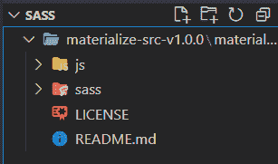
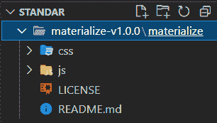
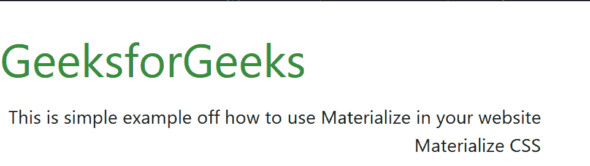

# 如何使用物化 CSS？

> 原文:[https://www.geeksforgeeks.org/how-to-use-materialize-css/](https://www.geeksforgeeks.org/how-to-use-materialize-css/)

[物化 CSS](https://www.geeksforgeeks.org/materialize-introduction-and-installation/) 是一种设计语言，用于开发设计系统，允许任何平台上所有产品的统一用户体验。

物化 CSS 有两种不同的形式，它们中的任何一种都可以通过简单地下载那个文件来使用，你可以使用物化 CSS 进入你的系统。

*   **物化:**这是标准版本，附带了缩小和非缩小的 CSS 和 JavaScript 文件。你可以从这个链接[下载这个文件](https://github.com/Dogfalo/materialize/releases/download/1.0.0/materialize-v1.0.0.zip)
*   **萨斯:**这个版本包含源 SCSS 文件。如果您选择这个版本，您可以更好地控制包含哪些组件，但是您需要一个 Sass 编译器。你可以从这个链接[下载这个文件](https://github.com/Dogfalo/materialize/releases/download/1.0.0/materialize-src-v1.0.0.zip)

**注意:**我们可以使用 CDN 链接或者通过 NPM 和鲍尔安装物化。

**使用 CDN 链接:**

> <链接 rel= "样式表" href = " https://cdnjs . cloudflare . com/Ajax/libs/物化/1 . 0 . 0/CSS/物化. min.css" >
> 
> <脚本 src = " https://cdnjs . cloudflare . com/Ajax/libs/物化/1 . 0 . 0/js/物化. min . js "></脚本>

**NPM 安装命令:**

```css
npm install materialize-css@next
```

**凉亭安装命令:**

```css
bower install materialize
```

**物化设置:**下载文件后，只需在项目文件夹中解压文件即可。您的物化文件夹将如下图所示。



厚颜无耻



实现

**HTML 设置:**现在只需创建一个 HTML 文件，您需要在其中导入物化，我们使用物化标准版本。

**示例 1:** 在本例中，我们将简单地使用文本颜色以及背景颜色。为了进行正确的对齐，我们将使用 *col* 和 *flow* 类。在代码中使用上述库，或者在下面给出的本地文件夹中使用它们。

## 超文本标记语言

```css
<!DOCTYPE html>
<html>

<head>

    <!--Import Google Icon Font-->
    <link href=
"https://fonts.googleapis.com/icon?family=Material+Icons"
        rel="stylesheet">

    <!--Import materialize.css-->
    <link type="text/css" rel="stylesheet"
        href="css/materialize.min.css" 
        media="screen,projection" />

    <!--Let browser know website is optimized for mobile-->
    <meta name="viewport" content=
        "width=device-width, initial-scale=1.0" />
</head>

<body>
    <h1 class="green-text text-darken-1">
        GeeksforGeeks
    </h1>

    <div class="row">
        <div class="col s12">
            <span class="flow-text green darken-1">
                A Computer Science Portal for Geeks
            </span>
        </div>
    </div>

    <!--JavaScript at end of body for 
        optimized loading-->
    <script type="text/javascript" 
        src="js/materialize.min.js">
    </script>
</body>

</html>
```

**输出:**


**示例 2:** 在这个示例中，我们将简单地使用文本颜色以及类 *col* 和 *flow-text* 来进行漂亮的视觉设计。

## 超文本标记语言

```css
<!DOCTYPE html>
<html>

<head>
    <!--Import Google Icon Font-->
    <link href=
"https://fonts.googleapis.com/icon?family=Material+Icons"
        rel="stylesheet">

    <!--Import materialize.css-->
    <link type="text/css" rel="stylesheet" 
        href="css/materialize.min.css" 
        media="screen,projection" />

    <!--Let browser know website is 
        optimized for mobile-->
    <meta name="viewport" content=
        "width=device-width, initial-scale=1.0" />
</head>

<body>
    <h1 class="green-text text-darken-2">
        GeeksforGeeks
    </h1>

    <div class="row">
        <div class="col s12">
            <span class="flow-text">
                This is simple example off how to 
                use Materialize in your website
            </span>
        </div>

        <div class="col s6 offset-s6">
            <span class="flow-text">
                Materialize CSS
            </span>
        </div>
    </div>
    <!--JavaScript at end of body for 
        optimized loading-->
    <script type="text/javascript" 
        src="js/materialize.min.js">
    </script>
</body>

</html>
```

**输出:**

