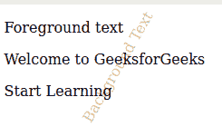

# 如何使用 CSS 使用文本作为背景？

> 原文:[https://www . geesforgeks . org/如何使用文本作为背景使用-css/](https://www.geeksforgeeks.org/how-to-use-text-as-background-using-css/)

有一些网站设计需要使用文本作为背景。使用 CSS 可以通过以下方法轻松实现这一点。

*   **Using absolutely positioned element inside relatively positioned element:** The absolutely positioned element inside a relative positioned element with absolute element having lower z-index value gives text appears as the background.

    **示例:**

    ```html
    <!DOCTYPE html>
    <html>

    <head>
        <title>
            Using text as background with CSS
        </title>

        <style>
            .container {
                position: relative;
            }

            .containerbackground {
                margin: 3rem;
                position: absolute;
                top: 0;
                left: 0;
                bottom: 0;
                z-index: -1;
                transform: rotate(300deg);
                -webkit-transform: rotate(300deg);
                color: #c6afaf;
            }
        </style>
    </head>

    <body>
        <div class="container">
            <div class="containerbackground">
                Background Text
            </div>
            <p>Foreground text</p>
            <p>Welcome to GeeksforGeeks</p>
            <p>Start Learning</p>
        </div>
    </body>

    </html>
    ```

    **输出:**
    

*   **Using :after pseudo elements:** *Using :after pseudo elements* with *:after pseudo elements* having lower z-index value make it to appear as background. Use text inside :after pseudo element to make appear text as the background.

    **示例:**

    ```html
    <!DOCTYPE html>
    <html>

    <head>
        <title>
            Using text as background with CSS
        </title>

        <style>
            .bgtext {
                position: relative;
            }

            .bgtext:after {
                margin: 3rem;
                content: "Background text";
                position: absolute;
                transform: rotate(300deg);
                -webkit-transform: rotate(300deg);
                color: rgb(187, 182, 182);
                top: 0;
                left: 0;
                z-index: -1;
            }
        </style>
    </head>

    <body>
        <div class="bgtext">
            <p>Foreground text</p>
            <p>Welcome to GeeksforGeeks</p>
            <p>Start Learning</p>
        </div>
    </body>

    </html>
    ```

    **输出:**
    

*   **Using :before pseudo elements:** *Using :before pseudo elements* with *:before pseudo elements* having lower z-index value make it to appear as background. Use text inside *:before pseudo element* to make appear text as the background.

    **示例:**

    ```html
    <!DOCTYPE html>
    <html>

    <head>
        <title>
            Using text as background with CSS
        </title>

        <style>
            .bgtext {
                position: relative;
            }

            .bgtext:before {
                margin: 3rem;
                content: "Background text";
                position: absolute;
                transform: rotate(300deg);
                -webkit-transform: rotate(300deg);
                color: rgb(187, 182, 182);
                top: 0;
                left: 0;
                z-index: -1;
            }
        </style>
    </head>

    <body>
        <div class="bgtext">
            <p>Foreground text</p>
            <p>Welcome to GeeksforGeeks</p>
            <p>Start Learning</p>
        </div>
    </body>

    </html>       
    ```

    **输出:**
    