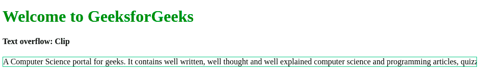
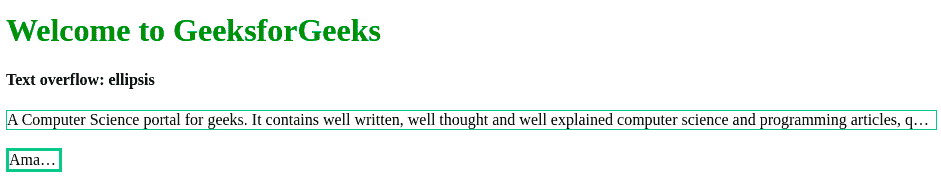

# 如何在 CSS 中使用文本溢出属性？

> 原文:[https://www . geeksforgeeks . org/如何使用-text-overflow-property-in-CSS/](https://www.geeksforgeeks.org/how-to-use-text-overflow-property-in-css/)

在本文中，我们将看到如何在 CSS 中设置文本溢出属性。**文本溢出属性**用于指定某些文本已经溢出并从用户的视野中隐藏。text-overflow 属性只影响溢出块容器元素的内容。

**语法:**

```html
text-overflow: clip| ellipsis
```

**属性值:**

*   **剪辑:**文字被剪辑，看不到。这是默认值。
*   **省略号:**文本被剪裁，剪裁后的文本表示为“…”。**T3】**

**注意:**CSS 中的**空格属性**是用来控制你在下面的例子中会遇到的文字换行和空格。

**示例 1:** 使用**剪辑**属性值。

## 超文本标记语言

```html
<!DOCTYPE html>
<html>

<head>
    <style>
        h1 {
            color: green;
        }

        .gfg {
            white-space: nowrap;
            width: 100%;
            overflow: hidden;
            text-overflow: clip;
            border: 1px solid #29bb89;
        }
    </style>
</head>

<body>
    <h1>Welcome to GeeksforGeeks</h1>
    <h4>Text overflow: Clip</h4>

    <div class="gfg">
        A Computer Science portal for 
        geeks. It contains well written, 
        well thought and well explained 
        computer science and programming 
        articles, quizzes and Gate 
        preparation Notes.
    </div>
</body>

</html>
```

**输出:**



**例 2:** 使用**省略号**属性值。

## 超文本标记语言

```html
<!DOCTYPE html>
<html>

<head>
    <style>
        h1 {
            color: green;
        }

        .gfg {
            white-space: nowrap;
            width: 100%;
            overflow: hidden;
            text-overflow: ellipsis;
            border: 1px solid #29bb89;
        }

        .gfg1 {
            white-space: nowrap;
            width: 50px;
            overflow: hidden;
            text-overflow: ellipsis;
            border: 3px solid #29bb89;
        }
    </style>
</head>

<body>
    <h1>Welcome to GeeksforGeeks</h1>
    <h4>Text overflow: ellipsis</h4>

    <div class="gfg">
        A Computer Science portal for geeks.
        It contains well written, well thought 
        and well explained computer science 
        and programming articles, quizzes 
        and Gate preparation Notes.
    </div>
    <br>
    <div class="gfg1"> Aman Rathod</div>
</body>

</html>
```

**输出:**

