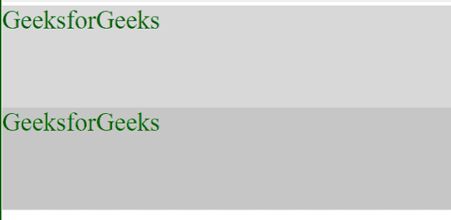
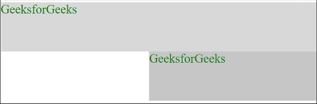
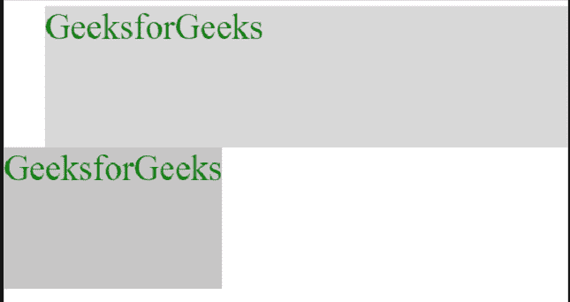
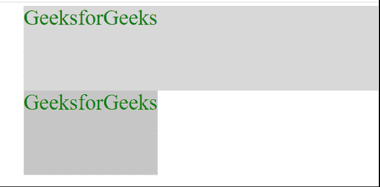

# 如何使用 CSS 中的 position 属性来对齐元素？

> 原文:[https://www . geeksforgeeks . org/如何使用 css 中的位置属性来对齐元素/](https://www.geeksforgeeks.org/how-to-use-the-position-property-in-css-to-align-elements/)

在本文中，我们将学习如何使用 CSS 中的 [***【位置】*** **属性来对齐元素。我们可以使用 CSS 的*位置*属性和它的一些辅助属性来对齐元素。**](https://www.geeksforgeeks.org/css-background-position-property/)

**方法:**位置 **属性** 用于设置元素的位置。我们可以使用*位置*属性和一些辅助属性*左|右|上|下*来对齐元素，辅助属性用于设置元素的坐标。要使用*位置*属性对齐元素，我们设置元素的位置，然后使用 helper 属性设置元素的坐标。

**语法:**

```html
position: static | relative | absolute | fixed | sticky
```

**示例 1:** 下面是将元素与中心对齐的上述方法的实现。

## 超文本标记语言

```html
<!DOCTYPE html>
<html lang="en">
<head>
    <style>
        .gfg-1{
            color: green; 
            background-color: rgb(216, 216, 216); 
        } 
        .gfg-2{
            background-color: rgb(199, 198, 198);
            color: green;
            /* Make element to relative to its normal position */
            position: relative;
            /* This set coordinates of the element and align it to center */
            left: 600px;
        }
    </style>
</head>
<body>
    <div class="gfg-1" style="height: 200px;font-size: 50px;">
           GeeksforGeeks
     </div>
    <div class="gfg-2" style="height: 200px;font-size: 50px;">
           GeeksforGeeks
     </div>
</body>
</html>
```

**输出:**

*   **定位前:**



定位前

*   **定位后:**



定位后

**例 2:**[*绝对*](https://www.geeksforgeeks.org/css-positioning-elements/) 位置根据页面取位置，因为绝对位置以页面为父。要根据父类来制作，我们必须在父类中添加 *relative* 。

## 超文本标记语言

```html
<!DOCTYPE html>
<html lang="en">
<head>
    <style>
        .gfg-1{
            color: green; 
            background-color: rgb(216, 216, 216); 
        } 
        .gfg-2{
            background-color: rgb(199, 198, 198);
            color: green;
            /* Make element to relative to its normal position */
            position: absolute;
            /* This set coordinates of the element*/
            left: 0px;
        }
        .parent{
            /* To make element relative */
            position: relative;
        }
    </style>
</head>
<body>
    <div class="parent" style="width: 50%;margin-left: 50px;">
        <div class="gfg-1" style="height: 200px;font-size: 50px;">
              GeeksforGeeks
        </div>
        <div class="gfg-2" style="height: 200px;font-size: 50px;">
              GeeksforGeeks
        </div>
    </div>
</body>
</html>
```

**输出:**

*   **定位前:**



定位前

*   **定位后:**



定位后