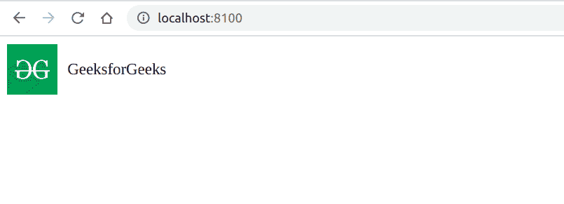
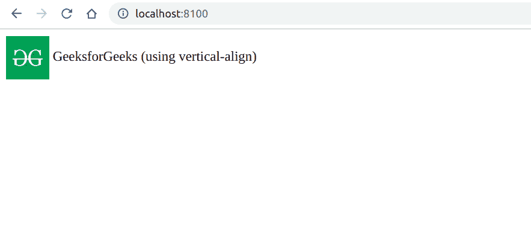

# 如何使用 CSS 垂直对齐图像旁边的文本？

> 原文:[https://www . geeksforgeeks . org/如何使用 css 垂直对齐图像旁边的文本/](https://www.geeksforgeeks.org/how-to-vertically-align-text-next-to-an-image-using-css/)

**简介:**我们经常在网站上添加图片，有时候需要在图片旁边垂直对齐文字。例如，在用户的个人资料图像的情况下，用户的名字应该在他/她的个人资料图片之后可见，并且应该垂直对齐。在本文中，我们将看到如何使用各种方法将文本与图像对齐。
**方法:**有两种方法可以垂直对齐图像旁边的文本，如下所示:

*   使用 flexbox
*   使用垂直对齐 CSS 属性

**使用*****flexbox*****:**在这个方法中，我们将使用 flexbox。为此，我们将使用 CSS 显示属性结合*对齐项*属性。我们需要创建一个包含图像和文本的父元素。使用*将父元素声明为 flexbox 后显示:flex*我们可以使用*对齐-项目:中心，将项目对齐到中心；*。
**语法:**

```html
.class_name { 
    display: flex;
    align-items:center;
}
```

**示例:**本示例使用 CSS 使用 flexbox 垂直对齐图像旁边的文本。

## 超文本标记语言

```html
<!DOCTYPE html>
<html>

<head>
    <title>
        How to Vertically Align Text
        Next to an Image using CSS ?
    </title>

    <style>
        .aligned {
            display: flex;
            align-items: center;
        }

        span {
            padding: 10px;
        }
    </style>
</head>

<body>
    <div class="aligned">
        

        <span>GeeksforGeeks</span>
    </div>
</body>

</html>
```

**输出:**



**使用** ***垂直对齐*** **CSS 属性:**在这种方法中，我们不需要将元素包装在父元素中，而使用*垂直对齐*属性直接垂直对齐元素。
**语法:**

```html
.class_name { vertical-align: middle; } 
```

**示例:**本示例使用垂直对齐属性，使用 CSS 垂直对齐图像旁边的文本。

## 超文本标记语言

```html
<!DOCTYPE hyml>
<html>

<head>
    <title>
        How to Vertically Align Text
        Next to an Image using CSS ?
    </title>

    <style>
        img {
            vertical-align: middle;
        }
    </style>
</head>

<body>
    

    <span>
        GeeksforGeeks (using vertical-align)
    </span>
</body>

</html>
```

**输出:**



CSS 是网页的基础，通过设计网站和网络应用程序用于网页开发。你可以通过以下 [CSS 教程](https://www.geeksforgeeks.org/css-tutorials/)和 [CSS 示例](https://www.geeksforgeeks.org/css-examples/)从头开始学习 CSS。